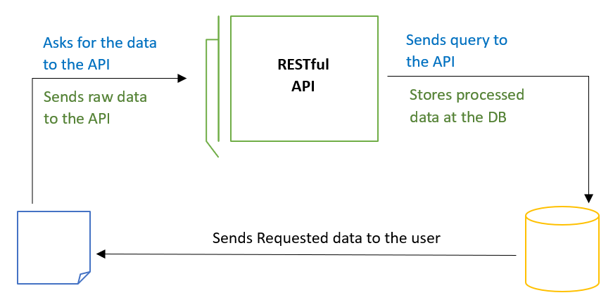
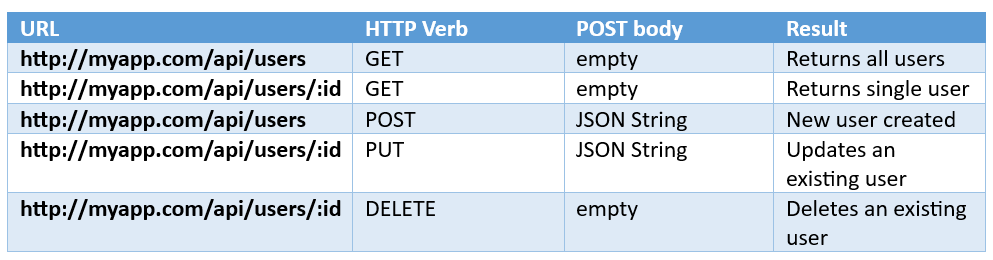
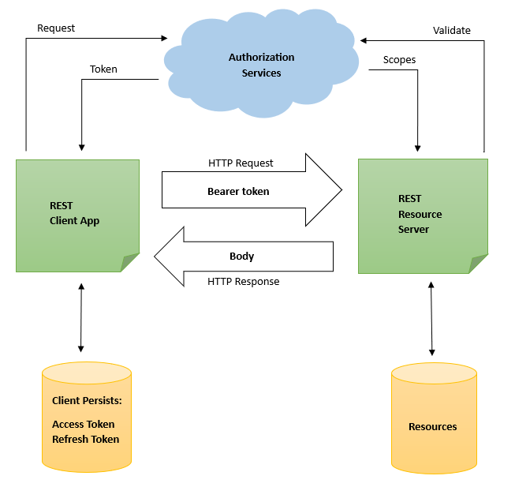

## Introduction

RESTful APIs are important in modern web development because they enable communication across different software systems. Whether you're building a web application, mobile app, or IoT device, understanding how to create robust and efficient APIs is essential. In this article, we'll explore the fundamentals of RESTful APIs and demonstrate how to build them using two popular Python frameworks: Flask and Django.

### Why RESTful APIs Matter

REST, or Representational State Transfer, is an architectural paradigm for creating networked applications. RESTful APIs adhere to the principles of REST, which include **statelessness**, **a uniform interface**, **client-server architecture**, **caching**, and **layered system**, among others.

The significance of RESTful APIs lies in their ability to provide a standardized way for systems to communicate over the internet. By following REST principles, developers can create APIs that are scalable, maintainable, and interoperable across different platforms and programming languages.



### Flask and Django: Frameworks for Building RESTful APIs

Flask and Django are two of the most popular Python web frameworks, each with its own strengths and use cases. While Flask is lightweight and flexible, Django is a more comprehensive framework that comes with built-in features for database management, authentication, and more.

In this article, we'll explore how to leverage the capabilities of Flask and Django to build RESTful APIs. Whether you prefer the simplicity of Flask or the batteries-included approach of Django, you'll find practical examples and code snippets to guide you through the process.

### Understanding REST Principles

Before diving into the code, it's essential to understand the principles that govern RESTful APIs. At the core of REST is the concept of resources, which are identified by **URIs (Uniform Resource Identifiers)**. These resources can be handled with conventional HTTP methods like **GET, POST, PUT, and DELETE**, which are equivalent to CRUD (Create, Read, Update, Delete) operations.

By adhering to REST principles, developers can design APIs that are intuitive, consistent, and easy to use. Throughout this article, we'll emphasize the importance of understanding these principles and applying them to our API designs.

## 1. Introduction to RESTful APIs

In this section, we'll provide a comprehensive introduction to RESTful APIs, covering everything from the basics of REST architecture to the benefits of using REST for web development.

### What is REST?

At its heart, REST is a design framework that specifies a set of restrictions for developing scalable web services. These constraints, which include statelessness, a uniform interface, and a client-server architecture, provide a framework for building distributed systems that are resilient and adaptable.

### Benefits of RESTful APIs

There are several advantages to using RESTful APIs in web development:

- **Scalability**: RESTful APIs are inherently scalable, allowing systems to handle increasing loads without sacrificing performance.
- **Flexibility**: By decoupling the client and server, RESTful APIs enable clients to evolve independently of the server implementation.
- **Interoperability**: RESTful APIs are platform-independent, meaning they can be accessed from any programming language or platform that supports HTTP.
- **Simplicity**: With its straightforward principles and HTTP-based architecture, REST simplifies the process of designing and consuming APIs.

### HTTP Methods and CRUD Operations

HTTP methods play a crucial role in RESTful API design, as they determine the actions that can be performed on a resource. Here's a brief overview of the most commonly used HTTP methods and their corresponding CRUD operations:

- **GET**: Retrieves data from the server.
- **POST**: Adds a new resource to the server.
- **PUT**: Updates an existing resource on the server.
- **DELETE**: Removes a resource from the server.

<div class="div-blue"> <span class="alert-header">Note:</span> By mapping CRUD operations to HTTP methods, RESTful APIs provide a standardized way to interact with resources, making it easier for developers to understand and use the API.</div>

## 2. Setting Up Flask/Django Projects for API Development

API development is a crucial aspect of modern web development, allowing different applications to communicate with each other seamlessly. In this article, we'll guide you through setting up a **Flask** or **Django** project for API development.

### 1. Creating a new Flask/Django project

#### Flask:
To create a new Flask project, you first need to install Flask if you haven't already:

```bash
pip install Flask
```

Then, you can create a new project directory and navigate into it:

```bash
mkdir my_flask_project
cd my_flask_project
```

#### Django:
For Django, you can use the following command to create a new project:

```bash
django-admin startproject my_django_project
cd my_django_project
```

### 2. Installing necessary dependencies for API development

#### Flask:
For Flask, a common set of dependencies includes Flask itself and Flask-RESTful for building RESTful APIs:

```bash
pip install Flask Flask-RESTful
```
<div class="div-red"> <span class="alert-header">Caution:</span> You might need additional packages depending on your requirements. </div>
 
#### Django:
Django comes with built-in support for creating APIs, but you might need additional packages like Django REST framework for more advanced features:

```bash
pip install django djangorestframework
```

### 3. Project structure overview

#### Flask:
A typical Flask project structure might look like this:

```
my_flask_project/
│
├── app.py
├── requirements.txt
└── ...
```

You can organize your Flask application as per your requirements.

<div class="div-blue"> <span class="alert-header">Note:</span>  app.py usually contains the main application logic.</div>

#### Django:
Django projects have a more structured layout:

```
my_django_project/
│
├── manage.py
├── my_django_project/
│   ├── settings.py
│   ├── urls.py
│   └── ...
└── ...
```

<div class="div-blue"> <span class="alert-header">Note:</span> manage.py is the entry point for interacting with your Django project, and settings.py contains project settings.</div>

### 4. Running the development server

#### Flask:
To run the development server for Flask, you simply execute your `app.py` file:

```bash
python app.py
```

This will start a development server on `http://127.0.0.1:5000/` by default.

#### Django:
For Django, you use `manage.py` to run the development server:

```bash
python manage.py runserver
```

The development server will be accessible at `http://127.0.0.1:8000/` by default.

Now that you have your Flask or Django project set up for API development, you can start building your APIs to power your applications.

For more detailed guides and documentation, refer to the official documentation for [Flask](https://flask.palletsprojects.com/) and [Django](https://docs.djangoproject.com/en/stable/).

## 3.Handling Requests and Responses

In web development, **handling requests and responses** is a fundamental aspect of building web applications. Whether you're using Flask or Django, understanding how to handle HTTP requests, serialize and deserialize data, and construct appropriate HTTP responses is crucial for building robust and efficient web services.

### Handling HTTP Requests in Flask/Django Views

Both Flask and Django provide mechanisms for handling incoming HTTP requests. In Flask, views are Python functions mapped to URL routes using decorators. Django, on the other hand, uses a URL dispatcher to map URL patterns to view functions or class-based views.

Here's an example of handling a GET request in Flask:

```python
from flask import Flask, request

app = Flask(__name__)

@app.route('/hello', methods=['GET'])
def hello():
    name = request.args.get('name', 'Guest')
    return f'Hello, {name}!'
```

<div class="div-green"> <span class="alert-header">Tip:</span> In Django, you might define a similar view using function-based views or class-based views.</div>

### Serializing and Deserializing Data (JSON, XML) in Flask/Django

When dealing with data in web applications, it's common to send and receive data in formats like JSON or XML. Flask and Django provide utilities for serializing and deserializing data to and from these formats.

In Flask, you can use the `jsonify` function to serialize Python objects to JSON:

```python
from flask import jsonify

data = {'name': 'John', 'age': 30}
return jsonify(data)
```

Django offers serializers for handling various data formats. For example, you can use Django's serializers to serialize querysets or model instances to JSON:

```python
from django.core.serializers import serialize

data = serialize('json', SomeModel.objects.all())
```

### Constructing HTTP Responses with Appropriate Status Codes

HTTP responses typically include a status code indicating the success or failure of a request, along with optional data. Flask and Django allow you to construct HTTP responses with the appropriate status codes.

In Flask:

```python
from flask import make_response

@app.route('/not_found')
def not_found():
    response = make_response('Resource not found', 404)
    return response
```

In Django:

```python
from django.http import HttpResponseNotFound

def not_found(request):
    return HttpResponseNotFound('Resource not found')
```

### Code Examples Demonstrating Request Handling and Response Construction

Here's a complete example in Flask demonstrating request handling and response construction:

```python
from flask import Flask, jsonify, request, make_response

app = Flask(__name__)

@app.route('/hello', methods=['GET'])
def hello():
    name = request.args.get('name', 'Guest')
    return f'Hello, {name}!'

@app.route('/not_found')
def not_found():
    response = make_response('Resource not found', 404)
    return response

@app.route('/json_example')
def json_example():
    data = {'message': 'Hello, JSON!'}
    return jsonify(data)

if __name__ == '__main__':
    app.run(debug=True)
```

Similarly, you can create Django views to handle requests and construct responses as needed.

## 4. URL Routing and Resource Endpoints

URL routing and resource endpoints are essential components in building web applications, especially when developing APIs using frameworks like Flask or Django. In this article, we'll delve into the significance of **defining URL routes**, mapping them to corresponding views or viewsets, utilizing URL parameters for dynamic resource retrieval, and provide code examples for better understanding.

### Defining URL Routes for API Endpoints

In web development, URL routes serve as the entry points to access different resources or functionalities of an application. In Flask or Django, URL routes are typically defined in the application's main **URL configuration file**. Each route is associated with a specific **HTTP method** (GET, POST, PUT, DELETE, etc.) and corresponds to a particular view or viewset.

Here's an example of defining URL routes in Flask:

```python
from flask import Flask

app = Flask(__name__)

@app.route('/')
def index():
    return 'Welcome to the homepage!'

@app.route('/api/resource', methods=['GET'])
def get_resource():
    # Logic to retrieve a resource
    return 'Resource data'

if __name__ == '__main__':
    app.run(debug=True)
```

### Mapping URL Routes to Corresponding Views or Viewsets

Once the URL routes are defined, they need to be mapped to the appropriate views or viewsets where the actual business logic resides. In Flask, views are Python functions decorated with `@app.route`, while in Django, views are typically defined as methods within a class-based viewset.

In Django, you might define URL routing in `urls.py`:

```python
from django.urls import path
from .views import MyViewSet

urlpatterns = [
    path('api/resource/', MyViewSet.as_view({'get': 'list'})),
]
```
Here, `MyViewSet` is a Django viewset that handles the logic for retrieving a resource.

### Using URL Parameters for Dynamic Resource Retrieval

URL parameters allow for dynamic retrieval of resources based on user input or other contextual information. These parameters are usually passed as part of the URL itself and can be accessed within the view or viewset to customize the response accordingly.

For example, a URL route for retrieving a specific resource might look like this:
```
/api/resource/<resource_id>/
```
And in the corresponding view or viewset, you can access `resource_id` to retrieve the specific resource with that identifier.



Throughout this article, we've provided code snippets demonstrating how to define URL routes and map them to views or viewsets in Flask and Django. These examples serve as a foundation for building robust APIs with clear and structured endpoint definitions.

## 5. Authentication and Authorization in Web APIs

In the realm of web development, **authentication** and **authorization** play vital roles in ensuring the security and integrity of applications. These concepts are particularly important when it comes to building **APIs** (Application Programming Interfaces) that expose sensitive data or perform critical actions.

### Implementing Authentication for API Endpoints

Authentication is the process of verifying the identity of a user or entity accessing an application or service. In the context of API endpoints, there are various methods for implementing authentication:

1. **Token-based Authentication**: One common approach is token-based authentication, where clients are issued unique tokens upon successful login. These tokens are then included in subsequent requests to authenticate the user's identity. This method is widely used due to its simplicity and scalability.

2. **JSON Web Tokens (JWT)**: [JWT](https://jwt.io/) is a concise, URL-safe method of encoding claims that will be exchanged between two parties. In the context of authentication, JWTs are often used to securely transmit information between the client and server, such as user roles or permissions.

### Enforcing Authorization Rules for Accessing API Resources

Authorization, on the other hand, determines what actions a user is allowed to perform within an application or API. Once a user is authenticated, authorization rules dictate which resources they can access and what operations they can perform on those resources.

To enforce authorization rules for accessing API resources, developers can implement role-based access control (RBAC), attribute-based access control (ABAC), or other custom authorization mechanisms tailored to their application's specific requirements.

### Integration with Flask/Django Authentication Libraries and Middleware

Frameworks like **Flask** and **Django** provide built-in support for implementing authentication and authorization in web applications. These frameworks offer various authentication libraries and middleware that streamline the process of securing API endpoints.

For example, Flask offers extensions like Flask-Login and Flask-JWT-Extended, while Django provides authentication backends and middleware for handling user authentication and authorization.

### Code Examples for Implementing Authentication and Authorization

Let's take a look at a basic example of implementing token-based authentication using Flask:

```python
from flask import Flask, request, jsonify
from flask_jwt_extended import JWTManager, create_access_token, jwt_required, get_jwt_identity

app = Flask(__name__)
app.config['JWT_SECRET_KEY'] ='supersecret' # Update this to a safe arbitrary key in deployment.
jwt = JWTManager(app)

# Mock user database
users = {
    'username': 'password'
}

@app.route('/login', methods=['POST'])
def login():
    data = request.get_json()
    username = data.get('username')
    password = data.get('password')
    
    if username in users and users[username] == password:
        access_token = create_access_token(identity=username)
        return jsonify(access_token=access_token), 200
    else:
        return jsonify({'error': 'Invalid username or password'}), 401

@app.route('/protected', methods=['GET'])
@jwt_required()
def protected():
    current_user = get_jwt_identity()
    return jsonify(logged_in_as=current_user), 200

if __name__ == '__main__':
    app.run(debug=True)
```
In this example, the `/login` endpoint verifies the user's credentials and generates a JWT access token upon successful authentication. The `/protected` endpoint requires a valid JWT token for access, enforced by the `@jwt_required()` decorator.



## 6. Serializers and Deserializers

In web development, **serialization** and **deserialization** are crucial concepts, especially in frameworks like Flask and Django. These processes involve converting complex data types into formats that can be easily transmitted over the network and then reconstructing them back into their original form. In this article, we'll delve into the fundamentals of serialization and deserialization, explore their implementation in Flask and Django, and provide code examples for better understanding.

### Introduction to Serialization and Deserialization

Serialization is the process of converting a complex data structure, such as a Python object or a database record, into a format that can be easily transmitted over a network or stored in a file. This format is typically **JSON (JavaScript Object Notation)** or **XML (eXtensible Markup Language)**, although other formats like YAML are also common. 

Deserialization, on the other hand, involves reconstructing the original data structure from the serialized format. This is often necessary when receiving data from a client request or reading from a file.

### Serialization and Deserialization in Flask/Django

Both Flask and Django come with built-in support for serialization and deserialization. In Django, the primary tool for serialization is the **Django REST Framework (DRF)**, which provides powerful serializers for converting model instances into JSON or XML representations. 

In Flask, serialization is typically handled using libraries like [Marshmallow](https://marshmallow.readthedocs.io/) or [Flask-RESTful](https://flask-restful.readthedocs.io/), which offer similar functionality to DRF's serializers.

### Using Serializers

Serializers play a crucial role in converting model instances into JSON or XML representations. In Django, serializers are defined using the `Serializer` class provided by DRF. Here's an example of how you might define a serializer for a simple model:

```python
from rest_framework import serializers
from myapp.models import MyModel

class MyModelSerializer(serializers.ModelSerializer):
    class Meta:
        model = MyModel
        fields = ['id', 'name', 'description']
```

Similarly, in Flask using Marshmallow, a serializer might be defined as follows:

```python
from marshmallow import Schema, fields

class MyModelSchema(Schema):
    id = fields.Int()
    name = fields.Str()
    description = fields.Str()
```

### Deserializing Request Data

Deserialization comes into play when processing incoming client requests. Both Flask and Django provide mechanisms for automatically deserializing request data into Python objects. 

In Django, DRF's serializers can be used in conjunction with Django's views to handle request data:

```python
from rest_framework.decorators import api_view
from rest_framework.response import Response
from myapp.serializers import MyModelSerializer

@api_view(['POST'])
def create_my_model(request):
    serializer = MyModelSerializer(data=request.data)
    if serializer.is_valid():
        serializer.save()
        return Response(serializer.data, status=201)
    return Response(serializer.errors, status=400)
```

In Flask, using Marshmallow, request data can be deserialized as follows:

```python
from flask import request, jsonify
from myapp.schemas import MyModelSchema

@app.route('/mymodel', methods=['POST'])
def create_mymodel():
    schema = MyModelSchema()
    data = schema.load(request.json)
    # Process the deserialized data
    return jsonify(data), 201
```

### Integration with Validation Libraries

In addition to serialization and deserialization, validation is often an important aspect of handling data in web applications. Both Flask and Django provide integration with validation libraries that can be used in conjunction with serializers to ensure that incoming data meets certain criteria.

In Django, DRF serializers come with built-in validation capabilities, allowing you to define rules for each field in your serializer. Similarly, in Flask, Marshmallow provides support for validation through its `Schema` class.

## 7. CRUD Operations with Flask/Django ORM

In this article, we'll explore how to perform CRUD operations (Create, Read, Update, Delete) using the Object-Relational Mapping (ORM) provided by **Flask** and **Django** frameworks. Both Flask and Django offer powerful ORM tools that simplify database interactions and make CRUD operations straightforward.

### Introduction to CRUD Operations

CRUD operations are fundamental in any web application as they enable the manipulation of data stored in a database. Here’s a quick rundown of each operation:

- **Create**: Adding new records to the database.
- **Read**: Retrieving existing records from the database.
- **Update**: Modifying existing records in the database.
- **Delete**: Removing records from the database.

### Performing CRUD Operations with Flask/Django ORM

#### Flask ORM

Flask provides a lightweight ORM called **SQLAlchemy**, which offers a high-level abstraction for interacting with relational databases. Let's take a look at how to perform CRUD operations using Flask and SQLAlchemy.

**1. Create Operation**

To create a new record in the database with Flask and SQLAlchemy, you can define a model class and use the `session.add()` method followed by `session.commit()`.

```python
from flask_sqlalchemy import SQLAlchemy

db = SQLAlchemy()

class User(db.Model):
    id = db.Column(db.Integer, primary_key=True)
    username = db.Column(db.String(80), unique=True, nullable=False)
    email = db.Column(db.String(120), unique=True, nullable=False)

# Creating a new user
new_user = User(username='john_doe', email='john@example.com')
db.session.add(new_user)
db.session.commit()
```
**2. Read Operation**

To retrieve records from the database, you can use SQLAlchemy's query methods such as `query.all()` or `query.filter()`.

```python
# Retrieving all users
all_users = User.query.all()

# Retrieving a specific user by ID
user = User.query.get(1)

# Filtering users by criteria
filtered_users = User.query.filter_by(username='john_doe').all()
```

**3. Update Operation**

Updating existing records involves fetching the record, modifying its attributes, and then committing the changes.

```python
# Fetching the user to update
user = User.query.get(1)

# Modifying user attributes
user.email = 'new_email@example.com'

# Committing the changes
db.session.commit()
```

**4. Delete Operation**

To delete records from the database, you can use the `session.delete()` method followed by `session.commit()`.

```python
# Fetching the user to delete
user = User.query.get(1)

# Deleting the user
db.session.delete(user)
db.session.commit()
```

#### Django ORM

Django comes with its built-in ORM, which provides a higher-level abstraction for interacting with databases. Let's see how to perform CRUD operations using Django's ORM.

**1. Create Operation**

With Django ORM, creating new records is as simple as creating a new instance of a model and calling the `save()` method.

```python
from myapp.models import User

# Creating a new user
new_user = User(username='john_doe', email='john@example.com')
new_user.save()
```
**2. Read Operation**

Reading records from the database in Django involves using queryset methods such as `all()`, `get()`, or `filter()`.

```python
# Retrieving all users
all_users = User.objects.all()

# Retrieving a specific user by ID
user = User.objects.get(pk=1)

# Filtering users by criteria
filtered_users = User.objects.filter(username='john_doe')
```
**3. Update Operation**

Updating records in Django is similar to Flask. You fetch the record, modify its attributes, and then call the `save()` method.

```python
# Fetching the user to update
user = User.objects.get(pk=1)

# Modifying user attributes
user.email = 'new_email@example.com'

# Saving the changes
user.save()
```
**4. Delete Operation**

Deleting records in Django involves fetching the record and calling the `delete()` method.

```python
# Fetching the user to delete
user = User.objects.get(pk=1)

# Deleting the user
user.delete()
```


### Handling Validation and Error Cases with Flask

In Flask, you can handle validation and error cases using Flask-WTF for forms and Flask's error handling mechanisms. Here's an example:

```python
from flask import Flask, render_template, request, redirect, url_for, flash
from flask_sqlalchemy import SQLAlchemy
from flask_wtf import FlaskForm
from wtforms import StringField, SubmitField
from wtforms.validators import DataRequired, Email

app = Flask(__name__)
app.config['SECRET_KEY'] = 'your_secret_key'
app.config['SQLALCHEMY_DATABASE_URI'] = 'sqlite:///your_database.db'

db = SQLAlchemy(app)

class User(db.Model):
    id = db.Column(db.Integer, primary_key=True)
    username = db.Column(db.String(80), unique=True, nullable=False)
    email = db.Column(db.String(120), unique=True, nullable=False)

class UserForm(FlaskForm):
    username = StringField('Username', validators=[DataRequired()])
    email = StringField('Email', validators=[DataRequired(), Email()])
    submit = SubmitField('Submit')

@app.route('/create_user', methods=['GET', 'POST'])
def create_user():
    form = UserForm()
    if form.validate_on_submit():
        new_user = User(username=form.username.data, email=form.email.data)
        db.session.add(new_user)
        db.session.commit()
        flash('User created successfully!', 'success')
        return redirect(url_for('index'))
    return render_template('create_user.html', form=form)

if __name__ == '__main__':
    app.run(debug=True)
```

In this code snippet, we use Flask-WTF to define a form for creating a new user. We validate the form data and handle errors appropriately.

### Handling Validation and Error Cases with Django

In Django, you can handle validation and error cases using Django forms and Django's built-in error handling features. Here's an example:

```python
from django import forms
from django.shortcuts import render, redirect
from .models import User

class UserForm(forms.ModelForm):
    class Meta:
        model = User
        fields = ['username', 'email']

def create_user(request):
    if request.method == 'POST':
        form = UserForm(request.POST)
        if form.is_valid():
            form.save()
            messages.success(request, 'User created successfully!')
            return redirect('index')
    else:
        form = UserForm()
    return render(request, 'create_user.html', {'form': form})
```

In this Django code snippet, we define a Django form for creating a new user. We validate the form data using `is_valid()` and handle errors appropriately using Django's built-in `messages` framework.

## 8. Versioning and Pagination: Best Practices for APIs

In the world of web development, **APIs** (Application Programming Interfaces) serve as a bridge between different software applications, allowing them to communicate and share data. However, as APIs evolve and grow, it becomes essential to manage changes effectively to ensure compatibility and usability. This article explores best practices for **versioning APIs** and handling **pagination** for large datasets, with a focus on implementation in Flask and Django frameworks.

### Versioning APIs - Best Practices for Versioning

Versioning an API is crucial to ensure backward compatibility while introducing new features or making changes. Below are some standard practices for versioning APIs:

1. **Semantic Versioning**: Adopting **Semantic Versioning** (SemVer) ensures that version numbers convey meaning about the underlying code changes. SemVer consists of three numbers separated by dots (e.g., MAJOR.MINOR.PATCH), where incrementing each number indicates specific types of changes.
   
2. **URL Versioning**: Including the version number in the URL (e.g., `/api/v1/resource`) is a common approach. It provides clear visibility and allows clients to specify the version they want to use explicitly.

3. **Header Versioning**: Alternatively, version information can be passed in the request headers. This approach keeps the URL clean but requires additional header parsing on both the client and server sides.

4. **Maintain Documentation**: Documenting API changes, including deprecated features and migration guides, helps developers understand and adapt to new versions seamlessly.

### Implementing API Versioning in Flask/Django

#### Flask

In Flask, you can implement API versioning using URL prefixes or custom request headers. Here's a simple example using URL prefixes:

```python
from flask import Flask

app = Flask(__name__)

@app.route('/api/v1/resource')
def get_resource():
    return 'This is version 1 of the resource.'

@app.route('/api/v2/resource')
def get_resource_v2():
    return 'This is version 2 of the resource.'

if __name__ == '__main__':
    app.run()
```

#### Django

Django offers built-in support for versioning through URL patterns. Here's how you can achieve API versioning in Django:

```python
from django.urls import path
from .views import resource_view_v1, resource_view_v2

urlpatterns = [
    path('api/v1/resource/', resource_view_v1),
    path('api/v2/resource/', resource_view_v2),
]
```
### Handling Pagination for Large Datasets

When dealing with large datasets, returning all records at once can overwhelm both the server and client. Pagination solves this problem by splitting data into manageable chunks. Here's how to handle pagination effectively:

1. **Limit-Offset Pagination**: This method involves specifying a limit (number of items per page) and an offset (starting point). Subsequent pages are fetched by incrementing the offset.

2. **Cursor Pagination**: Cursor pagination uses a unique identifier (e.g., primary key) to fetch the next set of results. It avoids issues with skipping or duplicating records when data is modified between requests.

3. **Metadata Response**: Include metadata in the API response to provide information about total record count, current page number, and links to previous and next pages.

### Code Examples for Versioning and Pagination

For comprehensive code examples on API versioning and pagination in Flask and Django, refer to the following repositories:

- [Flask Versioning Example](https://github.com/samanyougarg/rest-api-example)
- [Django Pagination Example](https://github.com/testdrivenio/django-pagination-example)

In summary, versioning APIs and implementing pagination are essential aspects of API development. By following best practices and using appropriate techniques, developers can ensure scalability, maintainability, and compatibility in their applications.

## 9. Testing RESTful APIs

Testing RESTful APIs is a crucial aspect of software development to ensure their functionality, reliability, and performance. In this section, we'll explore various testing approaches, techniques, and tools for testing Flask and Django APIs.

### Overview of Testing Approaches

When it comes to testing RESTful APIs, there are several approaches you can take:

1. **Unit Testing:** Testing individual components or functions of the API in isolation to verify that they work as expected.
2. **Integration Testing:** Testing the interactions between different components or modules to ensure they integrate correctly.
3. **End-to-End Testing:** Testing the entire system from start to finish to validate the flow of data and functionality.

### Writing Unit and Integration Tests

For Flask and Django APIs, writing unit and integration tests is essential to maintain code quality and prevent regressions. Here's how you can do it:

- **Flask:** Use the built-in `unittest` module or popular testing frameworks like **pytest** to write unit tests for Flask routes and integration tests for testing interactions between different parts of the application.

- **Django:** Django provides a built-in testing framework with tools like the **TestCase** class for writing unit tests and the **Client** class for simulating HTTP requests to test views.

### Using Testing Libraries and Frameworks

There are several testing libraries and frameworks available for Python that can streamline the testing process:

- **[pytest](https://docs.pytest.org/en/latest/):** A feature-rich testing framework that makes writing simple and scalable tests easy. It offers powerful features such as fixtures, parametrization, and plugins.

- **Django REST framework's test client:** Specifically designed for testing Django REST APIs, it provides a simple yet powerful interface for making requests to API endpoints and validating responses.

### Code Examples

Let's take a look at some code examples for testing Flask and Django APIs:

```python
# Flask Unit Test Example
import unittest
from myapp import app

class TestApp(unittest.TestCase):
    def setUp(self):
        self.app = app.test_client()

    def test_hello_world(self):
        response = self.app.get('/')
        self.assertEqual(response.status_code, 200)
        self.assertEqual(response.data, b'Hello, World!')

# Django Integration Test Example
from django.test import TestCase
from myapp.models import MyModel

class MyModelTestCase(TestCase):
    def setUp(self):
        MyModel.objects.create(name='Test')

    def test_my_model(self):
        obj = MyModel.objects.get(name='Test')
        self.assertEqual(obj.name, 'Test')
```

## 10. Deployment and Documentation

Deploying Flask and Django APIs is a crucial step in making them accessible to users. Additionally, documenting your APIs helps other developers understand how to interact with them effectively.

### Deployment Options

There are various deployment options available for Flask and Django APIs:

- **Docker:** Containerization allows you to package your application with its dependencies into a standardized unit, making it easy to deploy and scale.
- **Heroku:** A cloud platform that enables you to deploy, manage, and scale applications effortlessly.
- **AWS (Amazon Web Services):** Provides a range of services for deploying and hosting applications, including Elastic Beanstalk, Lambda, and EC2.

### Configuration for Production Environments

When deploying APIs to production, it's essential to configure them properly for performance, security, and scalability. 

<div class="div-red"> <span class="alert-header">Caution:</span> Its important to configure settings such as database connections, caching, logging, and security measures like HTTPS. </div>

### Generating API Documentation

Tools like [Swagger](https://swagger.io/docs/) and OpenAPI make it easy to generate interactive API documentation from your code. These tools automatically generate documentation based on annotations in your code, making it easier for developers to understand how to use your API.

### Code Examples

Here's an example of how you can deploy a Flask API using Heroku and generate API documentation with Swagger:

```bash
# Deploying Flask API to Heroku
$ heroku login
$ git init
$ heroku create myapp
$ git add .
$ git commit -m "Initial commit"
$ git push heroku master

# Generating API Documentation with Swagger
$ pip install flask-restx
```

```python
# app.py
from flask import Flask
from flask_restx import Api, Resource

app = Flask(__name__)
api = Api(app)

@api.route('/')
class HelloWorld(Resource):
    def get(self):
        """Returns 'Hello, World!'"""
        return {'message': 'Hello, World!'}

if __name__ == '__main__':
    app.run(debug=True)
```

```python
# swagger.py
from flask import Flask
from flask_restx import Api, Resource

app = Flask(__name__)
api = Api(app)

@api.route('/')
class HelloWorld(Resource):
    def get(self):
        """Returns 'Hello, World!'"""
        return {'message': 'Hello, World!'}

if __name__ == '__main__':
    app.run(debug=True)
```
## Conclusion

In conclusion, this article has provided a comprehensive guide to building **RESTful APIs** with **Flask** and **Django**, two popular frameworks in the world of web development. We began with an overview of REST principles and the significance of understanding them for designing APIs. Then, we delved into setting up Flask and Django projects for API development, including installing dependencies and structuring the project. We explored handling requests and responses, URL routing, authentication, and authorization, with **code examples** illustrating each concept. Additionally, we discussed serializers and deserializers, CRUD operations with Flask/Django ORM, versioning, pagination, and testing strategies for APIs. Finally, we covered deployment options and the importance of documenting APIs using tools like Swagger/OpenAPI. By following the practical examples and code snippets provided throughout the article, developers can confidently build robust and scalable RESTful APIs with Flask and Django. 

By following the practical examples and code snippets provided in this guide, you'll be well-equipped to design and implement RESTful APIs that meet the needs of your web development projects. Whether you choose Flask, Django, or another framework, the principles of REST will serve as a solid foundation for building scalable and interoperable APIs.

Now it's time to roll up your sleeves and get started! 

**Happy coding!**
