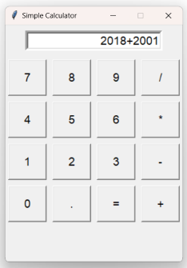
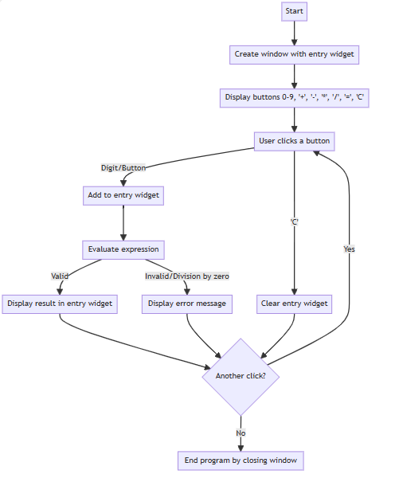
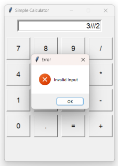

When working on a basic calculator with **Tkinter**, a widely-used GUI toolkit for **Python**. Tkinter streamlines the incorporation of user-friendly elements such as **buttons**, **entry**, **grid** and **custom styles** that are necessary for crafting graphical user interfaces, making it particularly well-suited for applications. Its simplicity and efficiency in managing user interactions make it an ideal choice for projects of this nature.
  
# Creating the Calculator 
Now let us actually dive into the process of building the calculator using one step at a time. All the required steps are given below, follow it one by one and you would be able to develop an efficient and interactive calculator.

## Step 1: Setting Up Environment
Before we start building our calculator, ensure that you have Python installed on your system. To do so the following section gives short information of the steps to be followed for different Platforms
**For Windows:**
1. Download and install Python from the [official website](https://www.python.org/downloads/)
2. Verify by running the following command:

		python --version

**For Linux:**
Follow the following commands for installation
1. Open terminal and copy and paste the code

		sudo apt-get update
		sudo apt-get install python3
		
3. Once installed verify by running the following command:

		python --version
		
 **For MacOs:**
1. Download and install Python from the [official website](https://www.python.org/downloads/macos/)
2. For reference [Steps to install python on MacOs](https://docs.python.org/3/using/mac.html)

Next, we need to install Tkinter, which is included with Python by default. So, there's no need to install it separately

## Step 2: Importing Libraries
In Python, the tkinter module is used for creating GUI applications. 
Now let's import these required libraries along with other required modules:

	import tkinter as tk
	from tkinter import messagebox

**Explanation**

**tkinter**: This module provides classes and functions for creating GUI applications.

**messagebox**: This submodule allows us to display message boxes for showing information or prompting the user for confirmation.

## Step 3: Creating the Calculator Class
Create a class called  `class Calculator` that will represent our calculator application:

	class Calculator:
	    def __init__(self, master):
	        self.master = master
	        self.master.title("Simple Calculator")
	        self.master.geometry("300x400")
	        self.master.resizable(False, False)
	        self.create_widgets()

	    def create_widgets(self):
	        # Create entry widget for displaying input and results
	        self.entry = tk.Entry(self.master, width=20, font=('Arial', 14), bd=5, justify="right")
	        self.entry.grid(row=0, column=0, columnspan=4, padx=10, pady=10)

	        # Define buttons
	        buttons = [
	            ('7', 1, 0), ('8', 1, 1), ('9', 1, 2), ('/', 1, 3),
	            ('4', 2, 0), ('5', 2, 1), ('6', 2, 2), ('*', 2, 3),
	            ('1', 3, 0), ('2', 3, 1), ('3', 3, 2), ('-', 3, 3),
	            ('0', 4, 0), ('.', 4, 1), ('=', 4, 2), ('+', 4, 3)
	        ]

	        # Create buttons using a loop
	        for (text, row, col) in buttons:
	            button = tk.Button(self.master, text=text, width=5, height=2, 
	            font=('Arial', 14), command=lambda t=text: self.on_button_click(t))
	            button.grid(row=row, column=col, padx=5, pady=5)

**Initialization**

The `init` method in the Calculator class sets up the basic features of the calculator when it's first created. It's like laying out the blueprint for how the calculator will look and work. The `master` part helps in putting the calculator in the right place on the screen. With `self.master.title("Simple Calculator")`, it gives the calculator window a name, like "Simple Calculator". The `self.master.geometry("300x400")` part determines how big the calculator window will be, making sure it's neither too small nor too big. The line `self.master.resizable(False, False)` prevents users from changing the size of the calculator window, keeping it neat and tidy. Finally, `self.create_widgets()` starts the process of actually creating all the buttons and numbers you see on the calculator screen. It's like setting up the stage before the show begins. So, with all these steps, the calculator is ready to go when you open it up!

**Widget Creation**

The `create_widgets` method orchestrates the construction of the calculator's user interface, beginning with the establishment of an Entry widget named `self.entry` for displaying input and results, meticulously configured with specific attributes such as width, font size, border width, and text alignment. Positioned within the window using the grid method, this Entry widget ensures clarity and organization of numerical data. Subsequently, utilizing a list named `buttons` containing tuples of button details, the method dynamically generates Button widgets for each entry within the list. These buttons, equipped with attributes such as text labels and dimensions, are seamlessly integrated into the window using the grid method, with each button assigned a command to execute the `on_button_click` method upon interaction, passing the corresponding button text as an argument. Through meticulous placement and configuration, the `create_widgets` method establishes a coherent and functional user interface, essential for intuitive interaction and efficient calculation.

## Step 4: Implementing Button Click Functionality
Next, we define the `on_button_click()` method to handle button clicks:

	 def on_button_click(self, text):
	          if text == '=':
	              try:
	                  result = eval(self.entry.get())
	                  self.entry.delete(0, tk.END)
	                  self.entry.insert(tk.END, str(result))
	              except Exception as e:
	                  messagebox.showerror("Error", "Invalid Input")

	          elif text == 'C':
	              self.entry.delete(0, tk.END)

	          else:
	              self.entry.insert(tk.END, text)

**Explanation:**

In this block of code, several conditional statements and actions are executed based on the text of the clicked button within the calculator interface. First, there's a check to see if the button text is equal to '=' (the equal sign). If so, the mathematical expression entered in the entry widget (self.entry) is evaluated using the `eval()` function, and the result is stored in the `result` variable. The contents of the entry widget are then cleared using `self.entry.delete(0, tk.END)`, and the calculated result is inserted into the entry widget using `self.entry.insert(tk.END, str(result))`. In case an exception occurs during evaluation, it's caught using a try-except block, and an error message box is displayed using `messagebox.showerror("Error", "Invalid Input")`. Lastly, the text of the clicked button is inserted into the entry widget at the end (tk.END) using `self.entry.insert(tk.END, text)`, allowing users to append their input string. These actions ensure proper functionality and user feedback within the calculator interface, facilitating smooth interaction and accurate computation.

## Step 5: Driver Function
Lastly, we need to create an instance of the Calculator class and run the `main` event loop:

	 if __name__ == "__main__":
	  root = tk.Tk()
	  app = Calculator(root)
	  root.mainloop()     

**Explanation:**

The line `if  name == "main":` serves as a conditional statement that ensures the subsequent code block is only executed if the Python script is directly run by the interpreter, rather than being imported as a module into another script. Following this condition, `root = tk.Tk()` initializes a new instance of the Tkinter Tk class, establishing the main window or root window for the graphical user interface (GUI) application. This window acts as a container for all other GUI elements to be displayed. Subsequently, `app = Calculator(root)` creates an instance of the Calculator class, utilizing the root window as an argument, thereby initializing the calculator application within this main window. Lastly, `root.mainloop()` initiates the Tkinter event loop, a critical component that continuously listens for user interactions, such as button clicks and window resizing, effectively maintaining the responsiveness of the GUI. This function call essentially blocks further script execution until the main window is closed by the user, ensuring the seamless functioning of the GUI application.

## Step 6: Outcome of Implementation 
   
  

# Code snippet

	import tkinter as tk
	from tkinter import messagebox

	class Calculator:
	    def __init__(self, master):
	        self.master = master
	        self.master.title("Simple Calculator")
	        self.master.geometry("300x400")
	        self.master.resizable(False, False)
	        self.create_widgets()

	    # creating the widgets
	    
	    def create_widgets(self):
	        # Create entry widget for displaying input and results
	        self.entry = tk.Entry(
	            self.master, width=20, font=("Arial", 14), bd=5, justify="right"
	        )
	        self.entry.grid(row=0, column=0, columnspan=4, padx=10, pady=10)

	        # Define buttons
	        buttons = [
	            ("7", 1, 0),
	            ("8", 1, 1),
	            ("9", 1, 2),
	            ("/", 1, 3),
	            ("4", 2, 0),
	            ("5", 2, 1),
	            ("6", 2, 2),
	            ("*", 2, 3),
	            ("1", 3, 0),
	            ("2", 3, 1),
	            ("3", 3, 2),
	            ("-", 3, 3),
	            ("0", 4, 0),
	            (".", 4, 1),
	            ("=", 4, 2),
	            ("+", 4, 3),
	        ]

	        # Create buttons using a loop
	        for text, row, col in buttons:
	            button = tk.Button(
	                self.master,
	                text=text,
	                width=5,
	                height=2,
	                font=("Arial", 14),
	                command=lambda t=text: self.on_button_click(t),
	            )
	            button.grid(row=row, column=col, padx=5, pady=5)

	    # funtion creation for on click feature
	    def on_button_click(self, text):
	        if text == "=":
	            try:
	                result = eval(self.entry.get())
	                self.entry.delete(0, tk.END)
	                self.entry.insert(tk.END, str(result))
	            except Exception as e:
	                messagebox.showerror("Error", "Invalid Input")

	        elif text == "C":
	            self.entry.delete(0, tk.END)

	        else:
	            self.entry.insert(tk.END, text)

	    # main funtion is defined                
	    if __name__ == "__main__":
	        root = tk.Tk()
	        app = Calculator(root)
	        root.mainloop()
  

# Understanding Code Functionality
- When the calculator starts, it creates a window with an entry widget. This widget is where you can input numbers and view the results.

- The calculator has buttons for digits 0-9, decimal point '.', and arithmetic operations like addition '+', subtraction '-', multiplication '*', and division '/'. These buttons are arranged in a grid layout.

  Tip:  Implement input validation to avoid potential security vulnerabilities or crashes.  

- When any button is clicked, it triggers the `on_button_click` function. If the button is an arithmetic operation or a digit, it adds that value to the entry widget. If the button is '=' (equal sign), it evaluates the expression in the entry widget and displays the result. If it's 'C' (clear), it clears the entry widget.

- When '=' is pressed, it tries to evaluate the expression entered in the entry widget using Python's `eval()` function. If the expression is valid, it computes the result and displays it in the entry widget. If there's an error, such as invalid input or division by zero, it shows an error message.

  Warning:  Avoid using the eval() function with untrusted input to prevent code injection vulnerabilities.  

- The program keeps running in a loop, waiting for user interactions, until the window is closed.

- Users can input numbers and perform arithmetic operations by clicking the respective buttons. They can clear the input by clicking 'C' and get the result by clicking '='.
# Calculator Functionality Flowchart
Following is an illustration of the functionality of a simple calculator program through a clear and logical flowchart.

# Testing Result 
&nbsp;&nbsp;&nbsp;&nbsp;&nbsp;&nbsp;&nbsp;&nbsp;

# Possible Errors that might occur
In building a calculator using Tkinter, potential errors include syntax mistakes, input validation issues, and challenges with complex operations. Effective debugging are crucial for ensuring the calculator functions reliably. Have a look on some of the problems along with their solutions that are listed below
## Division by zero error:

**Problem**: If the user divides by zero, Python will raise a ZeroDivisionError.

**Solution**: Handle division by zero within the try-except block.

    try:
    result = eval(self.entry.get())
    if result == float('inf'):
        messagebox.showerror("Error", "Division by zero")
    else:
        self.entry.delete(0, tk.END)
        self.entry.insert(tk.END, str(result))

## Syntax error in evaluation:

**Problem**: If the user enters an invalid expression that can't be evaluated, it will raise a SyntaxError.

**Solution**: Catch SyntaxError and display an appropriate error message.

     except SyntaxError:
     messagebox.showerror("Error", "Invalid Expression")

## NameError due to undefined variable:

**Problem**: The code checks for the '=' and 'C' buttons, but they're not defined in the button list.

**Solution**: Add the '=' and 'C' buttons to the list with their respective positions.

    buttons = [
        ...
        ('=', 4, 2), ('C', 4, 0)
     ]

## Missing import statement:

**Problem**: The code uses messagebox without importing it.

**Solution**: Import messagebox from tkinter.

	from tkinter import messagebox

## Unsupported operations:

**Problem**: The calculator allows arbitrary evaluation of expressions `using eval()`, which can lead to unintended consequences.

**Solution**: Restrict the input to a certain format or implement a safer method for evaluation, such as parsing the expression manually.
Here's a safer approach to evaluate expressions using `ast.literal_eval()`:

	  import ast
	  def evaluate_expression(self, expression):
	      try:
	          return ast.literal_eval(expression)
	      except (SyntaxError, ValueError):
	          raise ValueError("Invalid expression")
	  
	  def on_button_click(self, text):
	      if text == '=':
	          try:
	              result = self.evaluate_expression(self.entry.get())
	              self.entry.delete(0, tk.END)
	              self.entry.insert(tk.END, str(result))
	          except ValueError as e:
	              messagebox.showerror("Error", str(e))

# Conclusion:
In conclusion, developing a simple calculator using **Tkinter** in Python ,offers a practical introduction to GUI application development. Tkinter's intuitive design, coupled with its **cross-platform compatibility** ,empowers developers to create interactive interfaces effortlessly. By leveraging Tkinter's event-driven model, we constructed a calculator with **basic arithmetic operations**, **error handling**, and **clear functionality**. Utilizing widgets like **Entry** and **Button**, we orchestrated a user-friendly interface, enhancing accessibility and user experience.

Throughout the process, we capitalized on **object-oriented programming**  principles, encapsulating functionality within the Calculator class. This modular approach facilitates code organization and maintenance, promoting scalability and extensibility. Moreover, the integration of error handling mechanisms, such as **try-except blocks** and **message boxes**, underscores the importance of robustness in software design. These measures ensure graceful handling of unexpected inputs, enhancing the calculator's reliability and user confidence.

By adhering to best practices and leveraging Tkinter's capabilities, we've crafted a functional calculator application that demonstrates the synergy between Python's versatility and Tkinter's simplicity. This endeavor serves as a springboard for aspiring developers to delve deeper into GUI programming and explore the myriad possibilities of Python's ecosystem.

