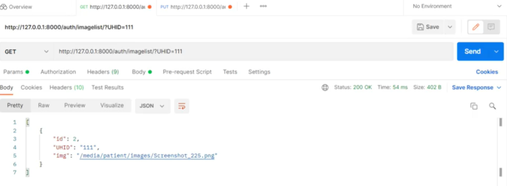
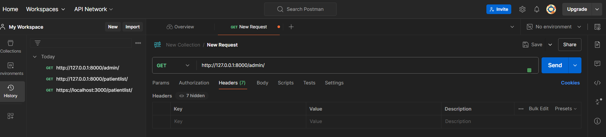

## Introduction

Django is a high-level Python web framework that promotes quick development and simple, practical design. It's renowned for its scalability, security, and versatility, making it a top choice for developers worldwide. In today's web development landscape, mastering Django is essential for building **robust web applications** efficiently.

Aspiring developers and seasoned professionals alike can benefit from diving into Django. Its rich set of features, including an **ORM (Object-Relational Mapping)** system, built-in **admin interface**, and **authentication system**, streamline the development process and empower developers to create complex applications with ease.

Throughout this comprehensive guide, we'll explore Django's core concepts, delve into its various components, and provide **code examples** to illustrate key concepts. Whether you're a beginner looking to get started with Django or an experienced developer seeking to deepen your understanding, this guide will equip you with the knowledge and skills needed to leverage Django effectively in your projects.

## 1. Getting Started with Django

Django is a high-level Python web framework that promotes fast development and simple, practical design. In this guide, we'll walk through the essential steps to get started with Django, from installation to running your first project.

### Installation of Django

Before you can start developing with Django, you need to install it on your system. You can install Django using pip, Python's package manager. Open your terminal or command prompt and type the following command:

```bash
pip install django
```

This command will download and install the latest version of Django from the Python Package Index (PyPI). Once the installation is complete, you can verify that Django is installed by running:

```bash
django-admin --version
```

### Creating a New Django Project

Now that Django has been installed, you can start a new Django project. Proceed to the directory where you wish to build your project and execute the following command:

```bash
django-admin startproject myproject
```

<div class="div-red"> <span class="alert-header">Caution:</span> Replace `myproject` with the name of your project. </div>

This command will create a new directory named `myproject` containing the basic files and folders for your Django project.

### Overview of Project Structure

A Django project is organized into several files and folders, each serving a specific purpose. Here's a brief overview of the project structure created by the `startproject` command:

- **myproject/**: The main project directory.
  - **manage.py**: A command-line utility for interacting with your Django project.
  - **myproject/**: The actual Django project package.
    - **settings.py**: Configuration settings for your project.
    - **urls.py**: URL declarations for the project.
    - **wsgi.py**: Entry point for WSGI-compatible web servers.

### Running the Development Server

To test your Django project locally, you need to run the development server. Navigate to your project directory and type the following command:

```bash
python manage.py runserver
```

This command will start the development server on your local machine. You can access your Django project by opening a web browser and navigating to `http://127.0.0.1:8000/`.


### Hello World Example

Let's create a simple "Hello, World!" view to test our Django project. Open the `views.py` file inside the `myproject` directory and add the following code:

```python
from django.http import HttpResponse

def hello_world(request):
    return HttpResponse("Hello, World!")
```

Next, we need to map this view to a URL. Open the `urls.py` file in the `myproject` directory and enter the following code:

```python
from django.urls import path
from . import views

urlpatterns = [
    path('hello/', views.hello_world, name='hello_world'),
]
```
Now, if you navigate to `http://127.0.0.1:8000/hello/` in your web browser, you should see the message "Hello, World!" displayed on the page.

## 2. Django Models

In this section, we'll delve into the fundamentals of Django models and its Object-Relational Mapping (ORM) system, which simplifies database interactions in Django applications.

### Introduction to Django Models and ORM

**Django models** are Python classes used to represent database tables. The Django ORM facilitates the translation of these classes into database schema and provides an intuitive API for interacting with the database. This abstraction layer allows developers to focus on application logic rather than database management.

### Defining Models and Their Fields

To define a model in Django, create a Python class that inherits from `django.db.models.Model`. Each attribute in the class denotes a database field. Django provides various field types such as CharField, IntegerField, DateTimeField, and ForeignKey, among others, to define the structure of the database table.

```python
from django.db import models

class Product(models.Model):
    name = models.CharField(max_length=100)
    price = models.DecimalField(max_digits=10, decimal_places=2)
    description = models.TextField()
    created_at = models.DateTimeField(auto_now_add=True)
```

### Performing CRUD Operations with Models

Django models support the four basic operations: Create, Read, Update, and Delete (CRUD). These operations can be performed using the model's API methods: `save()` for Create and Update, `delete()` for Delete, and querying methods for Read operations.

```python
# Create
product = Product.objects.create(name='Example Product', price=99.99, description='Lorem ipsum...')

# Read
products = Product.objects.all()

# Update
product.name = 'New Product Name'
product.save()

# Delete
product.delete()
```

### Querying Data with Django ORM

Django ORM provides a powerful querying API to retrieve data from the database. Querysets are lazily evaluated, allowing for efficient database operations. Querysets support various methods for filtering, ordering, aggregating, and annotating data.

```python
# Filtering
products = Product.objects.filter(price__gte=50)

# Ordering
products = Product.objects.order_by('-price')

# Aggregating
average_price = Product.objects.aggregate(avg_price=models.Avg('price'))
```

### Code Examples for Defining Models and Querying Data

For more detailed examples and best practices for defining Django models and querying data, refer to the official [Django documentation](https://docs.djangoproject.com/en/stable/topics/db/models/) and the [Django ORM Cookbook](https://books.agiliq.com/projects/django-orm-cookbook/en/latest/).


## 3. Django Views and URLs

In Django, **views** and **URLs** play a crucial role in defining the behavior and structure of your web application. Let's delve into the intricacies of views and URLs in Django, exploring their concepts, implementation, and best practices.

### Understanding Views and URLs in Django

At the core of Django's web framework lies the concept of **views**. Views are Python functions or classes that receive web requests and return web responses. They encapsulate the logic of your application, handling user interactions and generating dynamic content to be displayed to the user.

**URLs** in Django serve as the entry points for different functionalities within your application. They define the mapping between a URL pattern and the corresponding view that should handle the request. By defining URLs, you establish the structure and navigation of your web application.

### Mapping URLs to Views

In Django, you can map URLs to views using the `urls.py` module within your Django app. This module contains a list of URL patterns defined using the `urlpatterns` variable. Each URL pattern is associated with a specific view function or class.

Here's an example of mapping a URL pattern to a view function in `urls.py`:

```python
from django.urls import path
from . import views

urlpatterns = [
    path('home/', views.home, name='home'),
    # Other URL patterns
]
```
In this example, the URL pattern `'home/'` is mapped to the `home` view function defined in the `views.py` module of the current app.

### Class-based Views vs Function-based Views

Django supports two main types of views: **class-based views** and **function-based views**. Class-based views provide a more object-oriented approach to defining views, allowing for better organization and reusability of code. Function-based views, on the other hand, are simpler and more straightforward, making them suitable for smaller, less complex applications.

Here's a comparison between class-based and function-based views:

- **Class-based Views**: 
  - Encapsulate view logic within classes.
  - Support inheritance and mixins for code reuse.
  - Provide built-in methods for handling HTTP requests (e.g., `get`, `post`).

- **Function-based Views**:
  - Define view logic as standalone functions.
  - Directly map HTTP methods to view functions (e.g., `def my_view(request)`).

Choose the type of view that best fits the requirements and complexity of your application.

### Passing Data from Views to Templates

One of the key tasks of views in Django is to pass data to templates for rendering dynamic content. Views can pass data to templates using the `context` dictionary, which contains key-value pairs of data to be rendered.

Here's an example of passing data from a view to a template:

```python
from django.shortcuts import render

def my_view(request):
    data = {'name': 'John', 'age': 30}
    return render(request, 'my_template.html', context=data)
```

In this example, the `data` dictionary is passed as the context to the `my_template.html` template, allowing the template to access the data and render it dynamically.

### Code Examples for Defining Views and URLs

For a hands-on understanding of defining views and URLs in Django, let's take a look at some code examples:

#### Defining a Function-based View:

```python
from django.http import HttpResponse

def my_view(request):
    return HttpResponse("Hello, world!")
```

#### Defining a Class-based View:

```python
from django.views import View
from django.http import HttpResponse

class MyView(View):
    def get(self, request):
        return HttpResponse("Hello, world!")
```
These examples illustrate how to define both function-based and class-based views in Django, along with mapping them to URL patterns in the `urls.py` module.

## 4. Django Templates

Django's template system plays a crucial role in separating the presentation layer from the business logic of web applications. In this section, we'll explore the fundamentals of Django templates, including their creation, rendering, inheritance, and passing context data.

### Introduction to Django's Template System

Django's template system is a powerful tool for building dynamic web pages by combining HTML with Django template language (DTL) syntax. Templates allow developers to create reusable components and easily generate HTML dynamically based on data from the server.

### Creating and Rendering Templates

To create a Django template, simply create a file with a `.html` extension within the `templates` directory of your Django app. You can then use template tags and filters to insert dynamic content, loop through data, and perform logic within the template.

```html
<!-- Example template: hello.html -->
<!DOCTYPE html>
<html lang="en">
<head>
    <meta charset="UTF-8">
    <title>Hello, {{ name }}</title>
</head>
<body>
    <h1>Hello, {{ name }}!</h1>
</body>
</html>
```

To render a template in a Django view, use the `render` shortcut function and pass the template name and context data as arguments.

```python
from django.shortcuts import render

def hello_view(request):
    name = "World"
    return render(request, 'hello.html', {'name': name})
```

### Template Inheritance and Extending Base Templates

Django templates support inheritance, allowing you to create a base template with common elements such as headers, footers, and navigation bars, and then extend it in other templates to override specific blocks.

```html
<!-- base.html -->
<!DOCTYPE html>
<html lang="en">
<head>
    <meta charset="UTF-8">
    <title>My Site</title>
</head>
<body>
    
</body>
</html>
```

```html
<!-- child.html -->


Child Page


    <h1>This is the child page</h1>

```

### Passing Context Data to Templates

Context data can be passed from views to templates using dictionaries. This allows you to dynamically populate templates with data from the server, making your web pages dynamic and responsive.

```python
from django.shortcuts import render

def hello_view(request):
    name = "World"
    return render(request, 'hello.html', {'name': name})
```
For a more in-depth understanding of Django templates and their usage, check out the official [Django documentation on templates](https://docs.djangoproject.com/en/3.2/topics/templates/). 

## 5. Django Forms

In this section, we'll explore the world of **Django Forms** and learn how to create, validate, and process HTML forms with Django. From basic form creation to advanced customization, we'll cover everything you need to know to work effectively with forms in Django.

### Creating HTML Forms with Django

Django provides a powerful form handling mechanism that simplifies the process of creating HTML forms in your web applications. By leveraging Django's built-in form classes and template tags, you can quickly generate forms with minimal boilerplate code. Check out the [official Django documentation on forms](https://docs.djangoproject.com/en/stable/topics/forms/) to get started.

Here's a basic example of how to create a simple form in Django:

```python
# forms.py
from django import forms

class MyForm(forms.Form):
    name = forms.CharField(max_length=100)
    email = forms.EmailField()
```

```html
<!-- template.html -->
<form method="post">
    
    {{ form.as_p }}
    <button type="submit">Submit</button>
</form>
```

### Form Validation and Handling Form Submissions

One of the key features of Django forms is built-in **form validation**. Django provides a range of validators that can be applied to form fields to ensure data integrity and security. Additionally, Django's form handling mechanism automatically handles form submissions, including data validation and error handling.

Here's an example of how to handle form submissions in Django views:

```python
# views.py
from django.shortcuts import render
from .forms import MyForm

def my_view(request):
    if request.method == 'POST':
        form = MyForm(request.POST)
        if form.is_valid():
            # Process the form data
            name = form.cleaned_data['name']
            email = form.cleaned_data['email']
            # Perform further actions
    else:
        form = MyForm()
    return render(request, 'template.html', {'form': form})
```

### Using Django Forms with Models

Django's form system seamlessly integrates with models, allowing you to create forms directly from model definitions. This enables you to perform CRUD (Create, Read, Update, Delete) operations on your database with minimal effort. Check out the [official Django documentation on model forms](https://docs.djangoproject.com/en/stable/topics/forms/modelforms/) for more details.

```python
# models.py
from django.db import models

class MyModel(models.Model):
    name = models.CharField(max_length=100)
    email = models.EmailField()
```

```python
# forms.py
from django import forms
from .models import MyModel

class MyModelForm(forms.ModelForm):
    class Meta:
        model = MyModel
        fields = ['name', 'email']
```

### Customizing Form Appearance and Behavior

Django forms offer extensive customization options for controlling the appearance and behavior of forms. You can customize form widgets, labels, error messages, and more to suit your application's requirements. Explore the [Django documentation on form customization](https://docs.djangoproject.com/en/stable/ref/forms/widgets/) for detailed guidance.

### Code Examples for Creating and Processing Forms

To reinforce your understanding of Django forms, here are some code examples demonstrating various form-related tasks:

- **Creating a custom form field**: Extend Django's form field classes to create custom form fields tailored to your application's needs.
- **Handling file uploads**: Learn how to handle file uploads using Django forms and process uploaded files securely.
- **Implementing form wizards**: Implement multi-step forms and form wizards to guide users through complex data entry processes.


## 6. Django Admin

In this section, we'll delve into the Django admin interface, a powerful tool for managing your Django project's data. We'll cover an overview of the Django admin interface, registering models with the admin site, customizing the admin interface, and exploring advanced admin features.

### Overview of Django Admin

The **Django admin interface** provides a user-friendly interface for managing and interacting with your project's data. It comes bundled with Django and offers CRUD (Create, Read, Update, Delete) functionality for your models out of the box. The admin interface is built using Django's powerful ORM (Object-Relational Mapping) and provides an intuitive way to perform administrative tasks without writing custom views or forms.

### Registering Models with the Admin Site

To make your models accessible in the admin interface, you need to **register** them with the admin site. This involves creating a `admin.py` file within your app directory and importing your models. Then, you can use the `admin.site.register()` method to register your models with the admin site. For example:

```python
from django.contrib import admin
from .models import YourModel

admin.site.register(YourModel)
```

### Customizing the Admin Interface

The Django admin interface is highly customizable, allowing you to tailor it to your project's specific needs and branding. You can customize various aspects of the admin interface, including the appearance, behavior, and functionality. Some common customizations include:

- **Customizing the appearance**: You can customize the appearance of the admin interface by overriding the default templates or using third-party packages like Django Suit or Django Grappelli.
- **Adding custom actions**: You can define custom actions to perform bulk operations on selected objects in the admin interface, such as exporting data or sending emails.
- **Customizing list views**: You can customize the list views of your models to display additional fields, filters, or search functionality.
- **Using inlines**: You can use inline models to edit related objects directly within the parent model's admin page.

### Advanced Admin Features

In addition to basic CRUD operations, the Django admin interface offers several advanced features to streamline your administrative tasks:

- **Custom actions**: Define custom actions to perform bulk operations on selected objects.
- **Inlines**: Edit related objects directly within the parent model's admin page.
- **ModelAdmin options**: Customize the behavior of your models in the admin interface using ModelAdmin options such as `list_display`, `list_filter`, and `search_fields`.
- **Permissions**: Control access to admin functionality based on user permissions.

### Code Examples

Let's demonstrate the topics stated above with some code examples:

#### Registering Models

```python
from django.contrib import admin
from .models import YourModel

admin.site.register(YourModel)
```

#### Customizing Admin Interface

```python
from django.contrib import admin
from .models import YourModel

class YourModelAdmin(admin.ModelAdmin):
    list_display = ['field1', 'field2', 'field3']

admin.site.register(YourModel, YourModelAdmin)
```


## 7. Django Authentication and Authorization

In any web application, managing user authentication and authorization is crucial for ensuring security and controlling access to sensitive information. Django, being a powerful web framework for building web applications, provides built-in tools for implementing **user authentication** and **authorization** seamlessly.

### Building user authentication with Django's built-in authentication system

Django's built-in authentication system provides ready-to-use components for handling user authentication tasks such as user registration, login, logout, and password management. To implement user authentication in your Django project, you can leverage Django's `auth` module.

```python
from django.contrib.auth.models import User
from django.contrib.auth import authenticate, login, logout

def register(request):
    if request.method == 'POST':
        # Handle user registration form submission
        ...
    else:
        # Display user registration form
        ...

def user_login(request):
    if request.method == 'POST':
        # Handle user login form submission
        ...
    else:
        # Display user login form
        ...
```

### User Registration and Login Views

To allow users to register and log in to your Django application, you'll need to create views for user registration and login. These views handle user input, validate credentials, and manage user sessions.

**User Registration View:**
- Allows users to create new accounts by providing required information.
- Validates user input and creates a new user account if the provided data is valid.
- Redirects users to the login page after successful registration.

**User Login View:**
- Authenticates users by verifying their credentials against the database.
- Creates a user session upon successful login, allowing users to access restricted views.
- Redirects authenticated users to the appropriate page after login.

### Restricting Access to Views Based on User Authentication

Once user authentication is implemented, you can restrict access to certain views or functionalities based on whether a user is authenticated or not. Django provides decorators such as `login_required` to enforce authentication requirements on views.

```python
from django.contrib.auth.decorators import login_required

@login_required
def restricted_view(request):
    # View code accessible only to authenticated users
    ...
```

### Code Examples for User Authentication and Authorization

For detailed code examples and best practices on implementing user authentication and authorization in Django, refer to the following external resources:
- [Django Documentation: Authentication](https://docs.djangoproject.com/en/3.2/topics/auth/)
- [Django Documentation: Authorization](https://docs.djangoproject.com/en/3.2/topics/auth/default/#authorization)


## 8. Django Rest Framework (DRF)

The Django Rest Framework (DRF) is a robust toolkit for creating **RESTful APIs** using Django, a popular Python web framework. In this article, we'll explore the fundamentals of DRF, including serializers, views, authentication, permissions, and provide code examples for building RESTful APIs.

### Introduction to DRF

Django Rest Framework (DRF) simplifies the process of building **RESTful APIs** by providing a set of tools and conventions for handling common tasks. It integrates seamlessly with Django, leveraging its features to create robust and scalable APIs.

### Serializers and Views in DRF

In DRF, **serializers** are used to convert complex data types such as queryset and model instances into native Python datatypes that can be easily rendered into JSON, XML, or other content types. **Views** in DRF are similar to Django views but provide built-in support for handling HTTP methods such as GET, POST, PUT, DELETE, etc., making it easier to create API endpoints.



### Authentication and Permissions in DRF

DRF provides flexible **authentication** and **permissions** mechanisms to secure your API endpoints. Authentication can be performed using tokens, session authentication, OAuth, or custom authentication schemes. Permissions control access to resources based on user roles and permissions defined in the application.

### Code Examples for Building RESTful APIs with DRF

```python
# Example serializers.py
from rest_framework import serializers
from .models import MyModel

class MyModelSerializer(serializers.ModelSerializer):
    class Meta:
        model = MyModel
        fields = '__all__'
```
```python
# Example views.py
from rest_framework import generics
from .models import MyModel
from .serializers import MyModelSerializer

class MyModelListView(generics.ListCreateAPIView):
    queryset = MyModel.objects.all()
    serializer_class = MyModelSerializer
```

```python
# Example urls.py
from django.urls import path
from .views import MyModelListView

urlpatterns = [
    path('mymodel/', MyModelListView.as_view(), name='mymodel-list'),
]
```


## 9. Django Middleware

Django Middleware is a system of hooks for Django's request/response processing. It's a lightweight, low-level plugin system that allows for **global request/response handling** within Django. In this section, we'll explore the fundamentals of Django Middleware, including writing custom middleware and using built-in middleware classes.

### Overview of Middleware in Django

Middleware in Django is a framework of hooks into Django's request/response processing. It's a lightweight, low-level plugin system that allows for global request/response handling within Django. Middleware can be used for a wide range of purposes, such as **authentication**, **logging**, **compression**, etc.

### Writing Custom Middleware

Custom middleware in Django allows developers to modify request or response objects, perform authentication, modify headers, and more. Custom middleware classes are defined as simple Python classes that implement the `__init__` and `__call__` methods.

### Using Built-in Middleware Classes

Django comes with several built-in middleware classes that provide common functionalities out of the box. These include **SessionMiddleware** for session management, **AuthenticationMiddleware** for associating users with requests, **CsrfViewMiddleware** for CSRF protection, and more.

### Code Examples for Writing and Using Middleware

```python
# Example custom middleware
class CustomMiddleware:
    def __init__(self, get_response):
        self.get_response = get_response

    def __call__(self, request):
        # Before calling the view or middleware, 
        # perform the following code for each request.
        response = self.get_response(request)
        # Code to be executed for each response before
        # it's returned to the client.
        return response
```

```python
# Example settings.py
MIDDLEWARE = [
    'django.middleware.security.SecurityMiddleware',
    'django.contrib.sessions.middleware.SessionMiddleware',
    'django.middleware.common.CommonMiddleware',
    'django.middleware.csrf.CsrfViewMiddleware',
    'django.contrib.auth.middleware.AuthenticationMiddleware',
    'django.contrib.messages.middleware.MessageMiddleware',
    'django.middleware.clickjacking.XFrameOptionsMiddleware',
    'path.to.CustomMiddleware',  # Custom middleware
]
```

## 10. Testing Django Applications

Testing is an essential aspect of **Django** development, ensuring that your applications function as expected and remain reliable throughout their lifecycle. In this section, we'll explore various aspects of testing in Django, including writing unit tests and integration tests, utilizing Django's test client, and providing code examples for writing tests.

### Overview of Testing in Django

**Testing** in **Django** involves verifying the functionality and behavior of your applications through automated tests. This process helps identify bugs, regressions, and inconsistencies in your codebase, enabling you to maintain the quality and reliability of your applications over time.

### Writing Unit Tests and Integration Tests

**Unit tests** focus on testing individual components or units of code in isolation, while **integration tests** evaluate the interactions between different components to ensure they work together correctly. In **Django**, you can use the built-in testing framework to write both unit tests and integration tests, leveraging features such as test cases, assertions, and fixtures to validate your application's behavior.

### Using Django's Test Client

Django provides a powerful **test client** that allows you to simulate user interactions and test your views and API endpoints. This facilitates thorough testing of your application's functionality and ensures it behaves as intended under various scenarios.

<div class="div-green"> <span class="alert-header">Tip:</span> With the test client, you can make requests to your application, inspect the responses, and assert that the expected behavior is observed. </div>

### Code Examples for Writing Tests in Django

Let's dive into some **code examples** to illustrate how to write tests in Django:

```python
from django.test import TestCase
from myapp.models import MyModel

class MyModelTestCase(TestCase):
    def setUp(self):
        MyModel.objects.create(name="Test")

    def test_my_model_name(self):
        obj = MyModel.objects.get(name="Test")
        self.assertEqual(obj.name, "Test")
```

In this example, we define a **test case** for a Django model called `MyModel`. We use the `setUp` method to create an instance of the model for testing purposes and then write a test method to verify that the model's name attribute matches the expected value.

## 11. Deployment

Deploying **Django** applications involves preparing your application for production and hosting it on a server accessible to users. In this section, we'll explore deployment options for Django applications, configuring Django for production, serving static files, handling media files, and provide code examples for deploying Django applications.

### Deployment Options for Django Applications

There are several **deployment options** available for **Django** applications, including cloud platforms like **Heroku**, **AWS**, and **DigitalOcean**, as well as traditional web hosting providers. Each option has its pros and cons, so it's essential to choose the one that best fits your project's requirements, budget, and scalability needs.

### Configuring Django for Production

When deploying a **Django** application for production, it's crucial to configure Django settings for optimal performance, security, and scalability. This includes settings related to database connections, security features like **HTTPS**, and caching mechanisms to improve application speed and responsiveness.

### Serving Static Files and Handling Media Files in Production

In a production environment, you'll need to serve **static files** such as CSS, JavaScript, and images, as well as handle **media files** uploaded by users. Django provides built-in support for managing static files and media files, allowing you to configure storage backends, URL paths, and file serving behavior according to your application's requirements.

### Code Examples for Deploying Django Applications

Let's take a look at some **code examples** demonstrating how to deploy Django applications on various platforms:

```bash
# Deploying Django on Heroku
heroku login
heroku create my-django-app
git push heroku master
heroku open
```
In this example, we use **Heroku** as the deployment platform for our Django application. 

<div class="div-blue"> <span class="alert-header">Note:</span> We log in to Heroku, create a new app, push our code to the Heroku remote repository, and open the deployed application in a web browser. </div>

[Heroku](https://www.heroku.com) - Heroku is a cloud platform that allows developers to create, deliver, manage, and grow apps rapidly and efficiently.

[AWS](https://aws.amazon.com) - Amazon Web Services (AWS) provides a wide range of cloud computing services, including computing power, storage, and databases, allowing developers to deploy and scale applications with ease.

[DigitalOcean](https://www.digitalocean.com) - DigitalOcean is a cloud infrastructure provider that offers scalable compute platforms, storage solutions, and networking resources for deploying and managing applications.


This image illustrates the deployment process for a Django application on a cloud platform, showcasing the steps involved in configuring, deploying, and managing the application in a production environment.

## Conclusion

In this comprehensive guide, we've delved into **Django**, a powerful web development framework widely acclaimed for its versatility and efficiency. Covering everything from the basics of setting up a Django project to advanced topics like authentication, **RESTful APIs**, and deployment, we've provided detailed explanations and code examples to aid in your understanding. Whether you're just starting out with Django or looking to enhance your skills, this guide serves as a valuable resource, offering insights into key concepts such as models, views, forms, authentication, testing, and deployment. We encourage readers to explore Django further, experiment with the provided examples, and dive deeper into the world of web development with Django. For those seeking additional resources, we've included links to the [official Django documentation](https://docs.djangoproject.com/en/stable/), recommended books, tutorials, and community forums, ensuring that you have all the tools and support needed to succeed in your Django journey.
