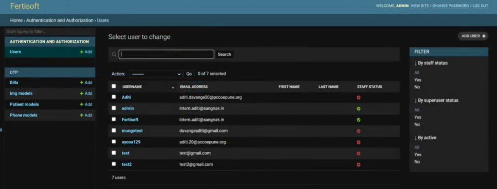
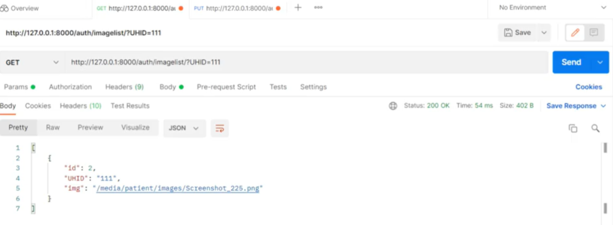
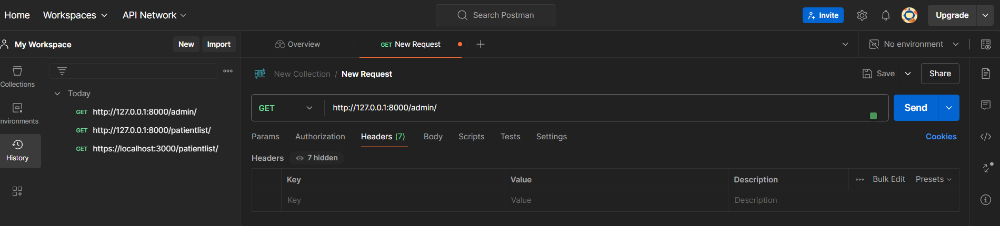

**Django** is a high-level **Python web framework** that is used for building web applications efficiently and with ease. It is known for its **scalability**, **security**, and **versatility**, and has a built-in **admin interface**, and **authentication system**. In this article, we will explore Django **models**, **views** and **templates**, along with an introduction to **Django Rest Framework**.

# Getting Started with Django

1. Open your terminal or command prompt and type the following command to install Django:

		pip install django

	
 Note:  You can verify that Django is installed by running: `django-admin --version`. 

2. To start a new Django project, navigate to the directory where you wish to build your project and run:

		django-admin startproject myproject

	
 Caution: Replace `myproject` with the name of your project. 

	This creates a new directory named `myproject` containing the basic files and folders for your Django project.

3. Open the `views.py` file inside the `myproject` directory and add the following code:

		from django.http import HttpResponse

		def hello_world(request):
		    return HttpResponse("Hello, World!")

4. To map this view to a URL, open the `urls.py` file in the `myproject` directory and add the following code:

		from django.urls import path
		from . import views

		urlpatterns = [path('hello/', views.hello_world, name='hello_world'),]

5. To run the development server, navigate to your project directory and type the following command in the terminal:

		python manage.py runserver

	This command will start the development server on your local machine. You can access your Django project by opening `http://127.0.0.1:8000/hello/` in your web browser, which displays "Hello, World!" on the page.

Output:

![Command Prompt][1]

![hello_world][2]

# Django Models

**Django models** are Python classes used to represent database tables. The **Django Object-Relational Mapping (ORM)** translates these classes into database schema and provides an API for interacting with the database.

1. To define a model, Django provides many field types such as CharField, IntegerField, DateTimeField, and ForeignKey, each denoting a field in the database table. In `models.py` file, create a Python class that inherits from `django.db.models.Model`, and define the structure of the database.

		from django.db import models

		class Bill(models.Model):
		    UHID = models.IntegerField()
		    date = models.DateField()
		    PatientName = models.CharField(max_length=100)
		    doctorName = models.CharField(max_length=100)
		    remark = models.CharField(max_length=100)

	This code creates 5 fields:
	- `UHID` field stores integer values.
	- `date` field store dates.
	- `PatientName`, `doctorName` and `remark` fields store a maximum of 100 characters.

2. Django models support the Create, Read, Update, and Delete (CRUD) operations. `save()` method is used to Create and Update, `delete()` method to Delete, and querying methods for Read operations.

		bill = Bill.objects.create(UHID=1, date=date(2024, 3, 2), PatientName='xyz', doctorName='ABC', remark='Lorem Epsom')      # Create
		bills = Bill.objects.all()     # Read
		bill.PatientName = 'XYZ'
		bill.save()       # Update
		bill.delete()      # Delete

3. **Querysets** allow efficient database retrieval operations by supporting various methods for filtering, ordering, aggregating, and annotating data.

		bills = Bill.objects.filter(UHID=1)     # Filtering
		bills = Bill.objects.order_by('-UHID')     # Ordering
		latest_bill_date = Bill.objects.aggregate(latest_date=Max('date'))['latest_date']     # Aggregating

Output:

![Django Models][3]

I encourage you to refer the [Django ORM Cookbook][4] for more information on querying.

# Django Views and URLs

**Views** are Python classes that receive web requests and return web responses. They handle user interactions and generate dynamic content to be displayed to the user.

**URLs** define the mapping between a URL pattern and the corresponding view that handles a request. By defining URLs, you establish the structure and navigation of your web application.

**Mapping URLs to Views**
You can map URLs to views using the `urls.py` module in your Django app. This file contains a list of URL patterns defined using the `urlpatterns` variable. Each URL pattern is mapped to a specific view defined in `views.py`.

**Class-based Views vs Function-based Views**
Django supports **class-based views** and **function-based views**. Following is a comparison between class-based and function-based views:

- **Class-based Views**: 
  - Encapsulate view logic within classes.
  - Support inheritance and mixins for code reuse.
  - Provide built-in methods for handling HTTP requests (e.g., `get`, `post`).

- **Function-based Views**:
  - Define view logic as standalone functions.
  - Directly map HTTP methods to view functions.

Let's take a look at a few examples to understand Views and URLs better:

- Function-based View:

	`views.py`:
	
		from django.http import HttpResponse

		def my_view(request):
		    return HttpResponse("Hello, world!")

	`urls.py`:

		from django.urls import path
		from .views import my_view
		
		urlpatterns = [path('hello/', my_view, name='my_view'),]

	This code maps the function `my_view` to the URL `hello/` directly,

Output:

![myview][2]

- Class-based View:

	`views.py`:
	
		from django.views import View
		from django.http import HttpResponse
		from django.shortcuts import render

		class MyView(View):
		    def get(self, request):
		        return HttpResponse("Hello, world!")
		     
		class PassDataView(View):
		    def get(self, request):
		        data = {'name': 'John', 'age': 30}
		        response = f"""
		        Welcome to My Template 
		        Name: {data['name']} 
		        Age: {data['age']}
		        """
		        return HttpResponse(response)

	`urls.py`:

		from django.urls import path
		from .views import MyView, PassDataView

		urlpatterns = [ 
			path('hello/', MyView.as_view(), name='my_view'), 
		  	path('pass_data/', PassDataView.as_view(), name='pass_data'),
		]

	Here, the two classes, `MyView` and `PassDataView`, each are mapped to the URLs `hello/` and `pass_data/` respectively.

Output:

![MyView][2]

![pass_data][5]

# Django Templates

Django's template system is a tool used to build dynamic web pages by combining HTML with Django template language (DTL) syntax. It allows you to create reusable components and generate HTML dynamically based on data from the server easily.

**Creating and Rendering Templates**
Create a file with a `.html` extension within the `templates` directory of your Django app. Template tags and filters can be used to insert dynamic data, loop through data, and perform logic within this template.
To render a template, use the `render` shortcut function and pass the template name and context data as arguments in the `views.py` file.

**Template Inheritance and Extending Base Templates**
In Django, you can create a base template with common elements such as headers, footers, etc., and then inherit it in other templates to override specific blocks.

Let's take a look at an example:

`base.html`:

	<!DOCTYPE html>
	<html lang="en">
	<head>
	    <meta charset="UTF-8">
	    <title>Base Template</title>
	</head>
	<body>
	    

	        <header>
	            <h1>Welcome to my website</h1>
	        </header>
	        <main>
	            
	            
	        </main>
	        <footer>
	            
&copy; 2024 My Website

	        </footer>
	    

	</body>
	</html>

`child.html`:

	

	Child Template

	
	    <h2>This is content for the child template</h2>
	    
Hello, {{ name }}! You are {{ age }} years old.

	

Context data from views, can be passed to templates using dictionaries. This enables you to dynamically enter data from the server into templates.

`views.py`:

	from django.shortcuts import render

	def child_view(request):
	    context = {
	        'name': 'John',
	        'age': 30
	    }
	    return render(request, 'child.html', context)

`urls.py`:

	from django.urls import path
	from . import views

	urlpatterns = [path('child/', views.child_view, name='child_view'),]

Output:

Visit the [Django documentation on templates][10] for more information.

# Django Forms

Django simplifies the process of creating HTML forms using its form handling mechanism. Using Django's built-in form classes and template tags, you can efficiently generate forms with minimal boilerplate code.

Django also allows built-in **form validation** and **error handling** using a range of validators that can be applied to form fields, ensuring data integrity and security.

Let's take an example as follows:

`create_product.html`:

	<!DOCTYPE html>
	<html>
	<head>
	    <title>Create Product</title>
	</head>
	<body>
	    <h2>Create a new product</h2>
	    <form method="post">
	        
	        {{ form.as_p }}
	        <button type="submit">Save</button>
	    </form>
	</body>
	</html>

`product_list.html`:

	<!DOCTYPE html>
	<html>
	<head>
	    <title>Product List</title>
	</head>
	<body>
	    <h2>Product List</h2>
	    <ul>
	        
	            <li>{{ product.name }} - {{ product.price }}</li>
	        
	    </ul>
	</body>
	</html>

`views.py`:

	from django.shortcuts import render, redirect
	from .models import Product
	from .forms import ProductForm

	def create_product(request):
	    if request.method == 'POST':
	        form = ProductForm(request.POST)
	        if form.is_valid():
	            form.save()
	            return redirect('product_list')
	    else:
	        form = ProductForm()
	    return render(request, 'create_product.html', {'form': form})

	def product_list(request):
	    products = Product.objects.all()
	    return render(request, 'product_list.html', {'products': products})

`urls.py`:

	from django.urls import path
	from . import views

	urlpatterns = [
	    path('create/', views.create_product, name='create_product'),
	    path('list/', views.product_list, name='product_list'),
	]

**Using Django Forms with Models**
Django's form system also integrates with models, allowing you to create forms directly from model definitions, enabling you to perform CRUD operations on your database easily.

`models.py`:

	from django.db import models

	class Product(models.Model):
	    name = models.CharField(max_length=100)
	    description = models.TextField()
	    price = models.DecimalField(max_digits=10, decimal_places=2)
	    created_at = models.DateTimeField(auto_now_add=True)

	    def __str__(self):
	        return self.name

`forms.py`:

	from django import forms
	from .models import Product

	class ProductForm(forms.ModelForm):
	    class Meta:
	        model = Product
	        fields = ['name', 'description', 'price']

Outputs:

# Django Admin

The **Django admin interface** provides a user-friendly interface to perform CRUD operations on your data. The interface is built using Django's ORM, which provides an effective way to perform administrative tasks.

1. You need to **register** your models with the admin site to access them in the interface. For this, you have to create a `admin.py` file in your app directory and import your models into it. Then, use the `admin.site.register()` method to register your models.
2. The Django admin interface allows you to tweak the interface to your project's needs. You can customize the admin interface's appearance, behavior, functionality, etc. Some common customizations include:

	- **Adding custom actions**: You can perform bulk operations on selected objects in the admin interface using custom actions. This can involve exporting data or sending emails.
	- **Customizing list views**: You can customize the list views to display additional fields, filters, etc.
	- **Inlines**: You can edit related objects directly within the parent model's admin page using inline models.
	- **ModelAdmin options**: ModelAdmin options such as `list_display`, `list_filter`, and `search_fields` can help you customize the behavior of your models in the interface.

Let's demonstrate the topics stated above with some code examples:

`admin.py`:

	from django.contrib import admin
	from .models import Category, Product

	@admin.action(description='Mark selected products as discounted')
	def make_discounted(modeladmin, request, queryset):
	    queryset.update(price=0)

	class ProductInline(admin.TabularInline):
	    model = Product
	    extra = 1

	class CategoryAdmin(admin.ModelAdmin):
	    inlines = [ProductInline]

	class ProductAdmin(admin.ModelAdmin):
	    list_display = ('name', 'category', 'price', 'created_at')
	    list_filter = ('created_at', 'price', 'category')
	    search_fields = ('name', 'description', 'category__name')
	    ordering = ('-created_at',)
	    list_editable = ('price',)
	    readonly_fields = ('created_at',)
	    fieldsets = (
	        (None, {
	            'fields': ('name', 'description', 'category')
	        }),
	        ('Advanced options', {
	            'classes': ('collapse',),
	            'fields': ('price', 'created_at'),
	        }),
	    )
	    prepopulated_fields = {'name': ('description',)}
	    actions = [make_discounted]

	admin.site.register(Category, CategoryAdmin)
	admin.site.register(Product, ProductAdmin)

`models.py`:

	from django.db import models

	class Category(models.Model):
	    name = models.CharField(max_length=100)

	    def __str__(self):
	        return self.name

	class Product(models.Model):
	    category = models.ForeignKey(Category, on_delete=models.CASCADE)
	    name = models.CharField(max_length=100)
	    description = models.TextField()
	    price = models.DecimalField(max_digits=10, decimal_places=2)
	    created_at = models.DateTimeField(auto_now_add=True)
	    
	    def __str__(self):
	        return self.name

`urls.py`:

	from django.contrib import admin
	from django.urls import path, include

	urlpatterns = [
	    path('admin/', admin.site.urls),
	    path('myapp/', include('myapp.urls')),
	]

# Django Authentication and Authorization

Django's `auth` module provides readily available components for handling user authentication tasks like user registration, login, logout, and password management.

**User Registration and Login Views**
To allow users to register and log in to your application, you'll need to create views for user registration and login. These views handle user input, validate credentials, and manage user sessions.
The User Registration View allows users to create a new account, validates the users' inputs, and redirects the users to the login page after successful registration.
The User Login View authenticates the users' credentials, creates a user session after login, and then redirects the users to the required page.

**Restricting Access to Views Based on User Authentication**
You can also restrict access to certain views or functionalities based on whether a user is authenticated or not. Decorators such as `login_required` can be used to enforce authentication requirements on views.

Let's take a look at sample `forms.py` and `views.py` files to understand this topic:

`forms.py`:

	from django import forms
	from django.contrib.auth.forms import UserCreationForm
	from django.contrib.auth.models import User

	class UserRegisterForm(UserCreationForm):
	    email = forms.EmailField()

	    class Meta:
	        model = User
	        fields = ['username', 'email', 'password1', 'password2']

`views.py`:

	from django.shortcuts import render, redirect
	from django.contrib.auth import login, authenticate
	from django.contrib.auth.forms import AuthenticationForm
	from django.contrib.auth.decorators import login_required
	from .forms import UserRegisterForm

	def register(request):
	    if request.method == 'POST':
	        form = UserRegisterForm(request.POST)
	        if form.is_valid():
	            form.save()
	            username = form.cleaned_data.get('username')
	            password = form.cleaned_data.get('password1')
	            user = authenticate(username=username, password=password)
	            login(request, user)
	            return redirect('home')
	    else:
	        form = UserRegisterForm()
	    return render(request, 'register.html', {'form': form})

	def login_view(request):
	    if request.method == 'POST':
	        form = AuthenticationForm(request, data=request.POST)
	        if form.is_valid():
	            username = form.cleaned_data.get('username')
	            password = form.cleaned_data.get('password')
	            user = authenticate(username=username, password=password)
	            if user is not None:
	                login(request, user)
	                return redirect('home')
	    else:
	        form = AuthenticationForm()
	    return render(request, 'login.html', {'form': form})

	@login_required
	def home(request):
	    return render(request, 'home.html')

Output:

# Django Rest Framework (DRF)

The Django Rest Framework (DRF) is an intuitive toolkit that allows you to create **RESTful APIs** using Django. Using tools like serializers, views, etc., scalable and flexible APIs can be built.

**Serializers and Views in DRF**
Serializers convert complex data types, such as queryset and model instances, into native Python datatypes. These can then be easily rendered into JSON, XML, or other formats.
Views in DRF are similar to Django views but additionally provide built-in support to handle HTTP methods such as GET, POST, PUT, DELETE, etc., and allow easy creation of API endpoints.

**Authentication and Permissions in DRF**
Authentication and permissions mechanisms provided by DRF can be used to secure your API endpoints. Tokens, session authentication, OAuth, or custom authentication schemes can be employed for authentication.  Access to resources can be controlled using permissions based on user roles and permissions defined in your application.

Let's take a look at an example to understand the concepts better:

`serializers.py`:

	from rest_framework import serializers
	from .models import MyModel

	class MyModelSerializer(serializers.ModelSerializer):
	    class Meta:
	        model = MyModel
	        fields = '__all__'

`views.py`:

	from rest_framework import generics
	from .models import MyModel
	from .serializers import MyModelSerializer

	class MyModelListView(generics.ListCreateAPIView):
	    queryset = MyModel.objects.all()
	    serializer_class = MyModelSerializer

`urls.py`:

	from django.urls import path
	from .views import MyModelListView

	urlpatterns = [
	    path('mymodel/', MyModelListView.as_view(), name='mymodel-list'),
	]

# Conclusion
**Django** is a powerful, yet flexible, Python framework used for building web applications. It provides **models** to interact with databases, **views** for handling requests, **URLs** for routing and **forms** to handle user input. Django also provides simple and efficient authorization and authentication mechanisms using the `auth` module. **DRF** is a versatile toolkit that allows you to build robust RESTful APIs for your web applications. I highly encourage you to take a look at the [official Django documentation][12] to explore more about this topic in detail.

[1]: command_prompt.png
[2]: hello_wrld.png
[3]: django_model.png
[4]: https://books.agiliq.com/projects/django-orm-cookbook/en/latest/
[5]: pass_data.png
[11]: https://docs.djangoproject.com/en/3.2/topics/templates/
[12]: https://docs.djangoproject.com/en/5.0/
