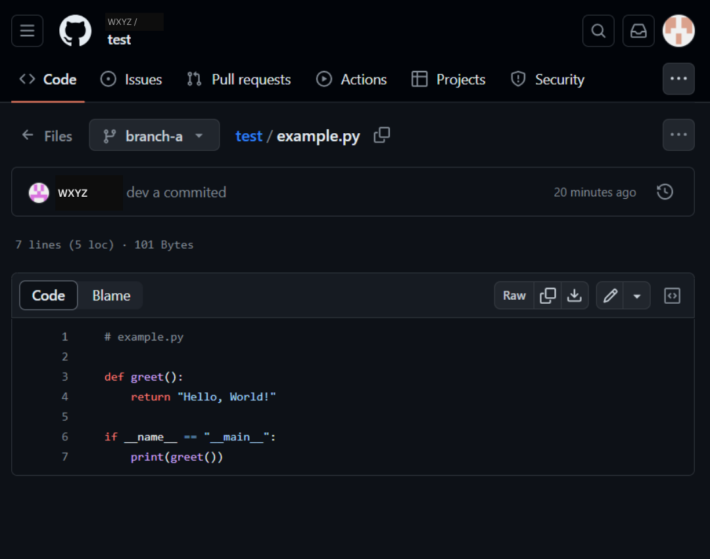
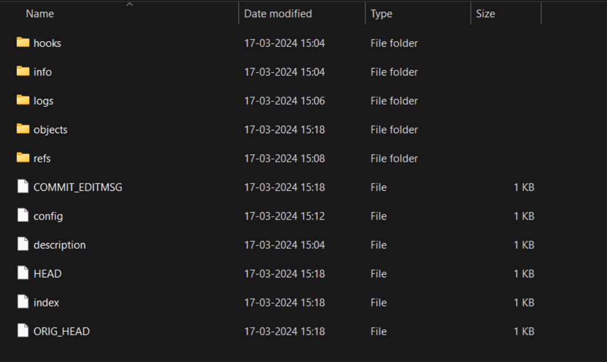

---

---

<h1 id="git-and-github-for-python-developers-a-comprehensive-guide">Git and GitHub for Python Developers: A Comprehensive Guide</h1>

Git and GitHub play a crucial role in the workflow of Python developers, providing essential tools for version control, collaboration, and project management. In this guide, we’ll explore the fundamentals of Git and GitHub and how Python developers can leverage them effectively. Let’s dive in!

<h2 id="brief-explanation">Brief Explanation</h2>

<strong>Git</strong> is a distributed version control system used in software development that tracks modifications to source code. It allows developers to collaborate on projects efficiently and manage codebase history effectively.

In contrast, <strong>GitHub</strong> is a web-based repository hosting platform for Git repositories. It offers additional features like issue tracking, pull requests, and project management tools, making it an ideal platform for open-source collaboration and project hosting.

Is Git useful for Python? Can Python be used with GitHub? Find out below!

<h3 id="why-git-and-github-are-essential-for-python-developers">Why Git and GitHub are Essential for Python Developers</h3>
<ul>
<li><strong>Version Control</strong>: Git enables Python developers to track changes in their codebase, revert to previous versions if needed, and collaborate seamlessly with team members. A system called version control keeps track of changes made to a file or group of files over time so that you can retrieve particular versions at a later time.</li>
<li><strong>Distributed Version Control</strong>: Distributed version control allows multiple developers to work on a project simultaneously. Each developer has their own copy of the repository, and changes can be merged together.</li>
<li><strong>Collaboration</strong>: GitHub provides a centralized platform for Python developers to work together, review code, and manage project tasks efficiently.</li>
<li><strong>Open Source Contribution</strong>: GitHub hosts millions of open-source projects, offering Python developers opportunities to contribute to various projects and enhance their skills.</li>
<li><strong>Project Hosting</strong>: Python developers can host their projects on GitHub, making it accessible to the community and facilitating collaboration.</li>
</ul>

can I run Python code on GitHub? Definitely! GitHub’s support for code hosting, version control, and integrated workflows makes it an ideal platform for running and managing Python code.

what is the best git and GitHub for Python developers? Git and GitHub, without a doubt! These tools provide essential functionalities for version control, collaboration, and project management, making them invaluable for Python developers.

<h4 id="master-real-world-python-skills-with-unlimited-access-to-real-python">Master Real-World Python Skills With Unlimited Access to Real Python</h4>

<a href="https://realpython.com/">Real Python</a> offers high-quality Python tutorials, articles, and resources to help you master Python programming and advance your career.

<h2 id="overview">Overview</h2>

We’ll discuss the following subjects in this post:

<ul>
<li>Getting Started with Git</li>
<li>Basic Git Commands</li>
<li>Working with Branches</li>
<li>Collaborating with GitHub</li>
<li>Advanced Git Concepts</li>
<li>Best Practices and Tips</li>
<li>Conclusion</li>
</ul>

Now, let’s delve into each topic in detail.

<h3 id="getting-started-with-git">Getting Started with Git</h3>
<h4 id="installing-git-on-different-platforms">1. Installing Git on Different Platforms</h4>

Where can you find Git and GitHub for Python developers download? Look no further than the official Git and GitHub websites, which offer downloads tailored for various platforms and provide comprehensive documentation for getting started. 
To install Git on your system, follow the instructions for your respective platform:

<ul>
<li><strong>Windows</strong>: Download the Git installer from <a href="https://git-scm.com/">git-scm.com</a> and follow the installation wizard.</li>
<li><strong>macOS</strong>: Install Git using Homebrew by running <code>brew install git</code> in the terminal.</li>
<li><strong>Linux</strong>: Install Git using your package manager. For instance, use <code>sudo apt install git</code> on Ubuntu.</li>
</ul>

what’s the significance of Git python library? The Git python library, also known as GitPython, is a valuable tool for Python developers, offering programmatic access to Git repositories and enabling automation of version control tasks.

Here’s the code snippet for importing GitPython into your Python projects:

<pre class=" language-python"><code class="prism  language-python"># Install GitPython package using pip
# You can run this command in your terminal or command prompt
# pip install GitPython

# Once GitPython is installed, you can import it in your Python code
import git

# Now you can use GitPython in your code to interact with Git repositories
</code></pre>

This code snippet demonstrates how to import GitPython into your Python projects after installing the GitPython package using pip.

<h4 id="configuring-git">2. Configuring Git</h4>

Once Git is installed, configure it with your username and email:

<pre class=" language-bash"><code class="prism  language-bash">git config --global user.name "Your Name"
git config --global user.email "your@email.com"
</code></pre>
<h4 id="creating-your-first-git-repository-locally">3. Creating Your First Git Repository Locally</h4>

To create a new Git repository for your Python project, navigate to your project directory in the terminal and run:

<pre class=" language-bash"><code class="prism  language-bash">git init
</code></pre>

This initializes a new Git repository in the current directory.

 
<em>Figure 1: Diagram illustrating a Git Repository</em>

<h3 id="basic-git-commands">Basic Git Commands</h3>
<h4 id="git-init">1. <code>git init</code></h4>

The <code>git init</code> command initializes a new Git repository in the current directory.

<h4 id="git-add">2. <code>git add</code></h4>

The command <code>git add</code> is used to stage changes for the subsequent commit. You can add specific files or directories:

<pre class=" language-bash"><code class="prism  language-bash">git add file.py            # Add a specific file
git add .                  # Add all changes in the current directory
</code></pre>

Caution: Avoid adding sensitive information such as passwords or API keys to a Git repository. Instead, make use of independent configuration files or environment variables.

<h4 id="git-commit">3. <code>git commit</code></h4>

The staged modifications are saved to the repository by using the <code>git commit</code> command:

<pre class=" language-bash"><code class="prism  language-bash">git commit -m "Commit message"
</code></pre>
<h4 id="git-status">4. <code>git status</code></h4>

The <code>git status</code> command shows the status of files in the repository:

<pre class=" language-bash"><code class="prism  language-bash">git status
</code></pre>
<h4 id="git-log">5. <code>git log</code></h4>

The <code>git log</code> command displays the commit history:

<pre class=" language-bash"><code class="prism  language-bash">git log
</code></pre>
<h4 id="git-diff">6. <code>git diff</code></h4>

The <code>git diff</code> command shows the differences between files:

<pre class=" language-bash"><code class="prism  language-bash">git diff file.py
</code></pre>

 
<em>Figure 2: Diagram illustrating  .git folder</em>

<h3 id="putting-it-all-together-simple-git-workflow">Putting It All Together: Simple Git Workflow</h3>
<ol>
<li>Clone the repository.</li>
<li>Make changes and stage them.</li>
<li>Commit changes with a descriptive message.</li>
<li>Push changes to the remote repository.</li>
<li>Repeat steps 2-4 as necessary.</li>
<li>Pull changes from the remote repository to stay up-to-date.</li>
</ol>

 
<em>Figure 3: Diagram illustrating  Git Workflow</em>

<h3 id="aside-the-staging-area">Aside: The Staging Area</h3>

The staging area is where changes are prepared before committing them to the repository. It allows for selective commits.

<h3 id="working-with-branches">Working with Branches</h3>
<h4 id="git-branch">1. <code>git branch</code></h4>

The <code>git branch</code> command lists, creates, or deletes branches:

<pre class=" language-bash"><code class="prism  language-bash">git branch                    # List branches
git branch new-feature        # Create a new branch
git branch -d branch-name     # Delete a branch
</code></pre>

 Tip: Use Meaningful Branch Names: When creating branches in Git, use descriptive names that reflect the purpose of the branch, such as feature/xyz or bugfix/123. 

<h4 id="git-checkout">2. <code>git checkout</code></h4>

The <code>git checkout</code> command switches between branches:

<pre class=" language-bash"><code class="prism  language-bash">git checkout branch-name
</code></pre>

<strong>Traveling Back in Time: Examining a Specific Version of Your Code</strong>

To revert your code to a previous commit, use the git checkout command followed by the commit hash:

<pre class=" language-bash"><code class="prism  language-bash">git checkout &lt;commit-hash&gt;
</code></pre>
<h4 id="merging-branches">3. Merging Branches</h4>

Merge branches using <code>git merge</code>:

<pre class=" language-bash"><code class="prism  language-bash">git merge branch-name
</code></pre>
<h4 id="resolving-merge-conflicts">4. Resolving Merge Conflicts</h4>

When merging branches, resolve conflicts by editing the conflicting files and then committing the changes.

 
<em>Figure 4: Diagram illustrating Git branch operations</em>

<h3 id="collaborating-with-github">Collaborating with GitHub</h3>

what’s the deal with Python GitHub? Python GitHub, a term synonymous with Python projects hosted on GitHub, offers a wealth of resources, libraries, and collaborative opportunities for Python developers.

<h4 id="creating-a-github-account">1. Creating a GitHub Account</h4>

Visit <a href="https://github.com/">github.com</a> and sign up for a free account.

 Note: License Your Projects: When hosting projects on GitHub, consider adding a license file (e.g., MIT, Apache) to define how others can use, modify, and distribute your code. It's an essential aspect of open-source collaboration and legal protection.

<h4 id="setting-up-ssh-keys">2. Setting up SSH Keys</h4>

Generate SSH keys and add them to your GitHub account for secure authentication:

<pre class=" language-bash"><code class="prism  language-bash">ssh-keygen -t rsa -b 4096 -C "your@email.com"
</code></pre>
<h4 id="pushing-local-repositories-to-github">3. Pushing Local Repositories to GitHub</h4>

To push your local repository to GitHub, use the following commands:

<pre class=" language-bash"><code class="prism  language-bash">git remote add origin git@github.com:username/repository.git
git push -u origin master
</code></pre>

 Caution: Be Careful with Force Push: Avoid using **git push --force** (or **-f**) unless absolutely necessary. Force pushing can overwrite history and cause irreversible changes, potentially leading to data loss for you and collaborators.

<h4 id="cloning-repositories-from-github">4. Cloning Repositories from GitHub</h4>

Use the following to copy a repository from GitHub to your PC:

<pre class=" language-bash"><code class="prism  language-bash">git clone git@github.com:username/repository.git
</code></pre>
<h4 id="forking-repositories-and-creating-pull-requests">5. Forking Repositories and Creating Pull Requests</h4>

Fork repositories on GitHub to contribute changes. Create a pull request to propose your changes for merging into the original repository.

 Tip: Regularly Update Your Forks: If you fork a repository on GitHub to contribute changes, remember to regularly update your fork with changes from the original repository to avoid conflicts and stay in sync.

<h4 id="reviewing-pull-requests-and-merging-changes">6. Reviewing Pull Requests and Merging Changes</h4>

Review pull requests submitted by collaborators and merge changes into the main branch after review.

 
<em>Figure 5: Diagram illustrating branches created by different collaborators</em>

<h4 id="fetching">7. Fetching</h4>

The git fetch command downloads objects and refs from another repository, but it does not merge them into your current branch.

<h3 id="aside-what-is-a-sha">Aside: What is a SHA</h3>

A SHA (Secure Hash Algorithm) is a unique identifier for a commit. It’s a 40-character string that uniquely identifies a commit.

<h3 id="advanced-git-concepts">Advanced Git Concepts</h3>
<h4 id="rebasing-commits">1. Rebasing Commits</h4>

Rebase commits to maintain a linear commit history:

<pre class=" language-bash"><code class="prism  language-bash">git rebase branch-name
</code></pre>

 Note: Understanding Git Rebase: While rebasing commits can create a cleaner commit history, it's important to understand that it rewrites commit history, which can cause conflicts for collaborators. Use with caution and communicate changes to team members.

<h4 id="git-aliases">2. Git Aliases</h4>

Define aliases for commonly used Git commands:

<pre class=" language-bash"><code class="prism  language-bash">git config --global alias.co checkout
</code></pre>
<h4 id="using-.gitignore">3. Using <code>.gitignore</code></h4>

Create a <code>.gitignore</code> file to specify files and directories to ignore:

<pre class=" language-bash"><code class="prism  language-bash">echo "venv/" &gt;&gt; .gitignore
</code></pre>
<h4 id="git-hooks">4. Git Hooks</h4>

Set up Git hooks for automation tasks like running tests before commits:

<pre class=" language-bash"><code class="prism  language-bash">nano .git/hooks/pre-commit
</code></pre>
<h4 id="cherry-picking-commits">5. Cherry-picking Commits</h4>

Cherry-pick commits from one branch to another:

<pre class=" language-bash"><code class="prism  language-bash">git cherry-pick &lt;commit-hash&gt;
</code></pre>

what about Git-python? Git-python, a Python library for interacting with Git repositories, offers a convenient way for Python developers to automate Git operations and integrate version control into their Python projects.

where can you find Git python examples? Git python examples abound in tutorials, documentation, and open-source projects hosted on GitHub, providing practical demonstrations of Git usage in Python development.

how do you perform git-python install? Installing git-python is straightforward: simply use pip to install the GitPython package, which provides a Python interface for interacting with Git repositories.

<h3 id="best-practices-and-tips">Best Practices and Tips</h3>
<h4 id="writing-descriptive-commit-messages">1. Writing Descriptive Commit Messages</h4>

Provide clear and concise commit messages that describe the changes made.

<h4 id="keeping-commits-atomic-and-focused">2. Keeping Commits Atomic and Focused</h4>

Commit small, focused changes to keep the commit history clean and understandable.

<h4 id="using-branches-effectively">3. Using Branches Effectively</h4>

Use branches for feature development, bug fixes, and experimentation.

 
<em>Figure 6: Diagram illustrating Git network graph</em>

<h4 id="regularly-pulling-changes">4. Regularly Pulling Changes</h4>

Pull changes from remote repositories frequently to stay up-to-date with the latest developments.

The git pull command fetches changes from a remote repository and merges them into your current branch.

<h4 id="collaborating-effectively">5. Collaborating Effectively</h4>

Communicate with team members, participate in code reviews, and follow project guidelines for effective collaboration.

<h4 id="handling-large-repositories">6. Handling Large Repositories</h4>

Optimize repository size, use shallow clones when necessary, and adopt efficient Git workflows for managing large projects.

<h3 id="conclusion">Conclusion</h3>

In this comprehensive guide, we’ve covered essential Git and GitHub concepts tailored specifically for Python developers. By mastering these tools, you can efficiently manage your projects, collaborate with others, and contribute to the Python ecosystem effectively.

Keep exploring

