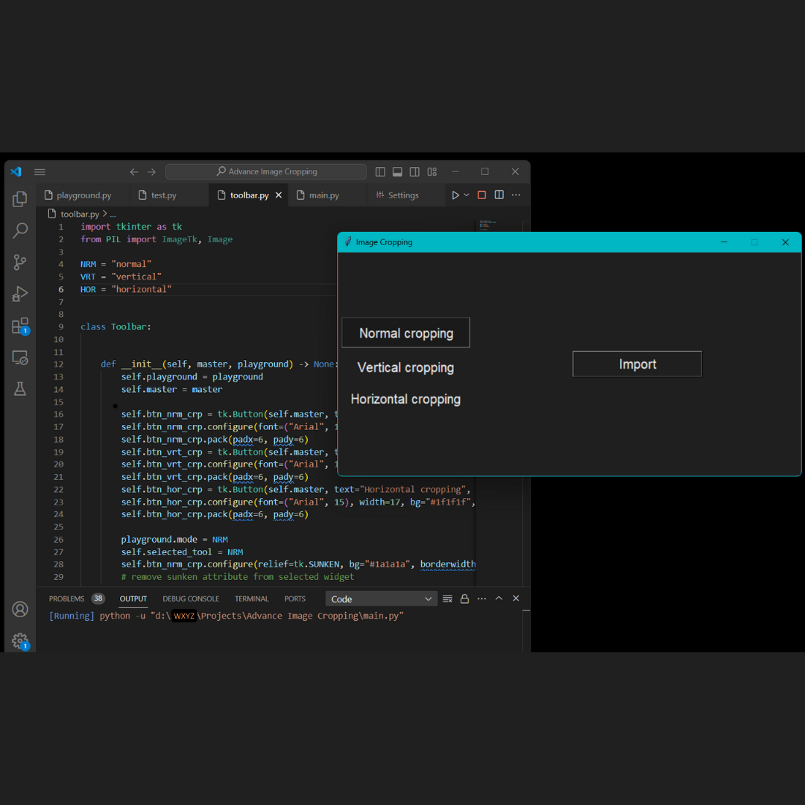
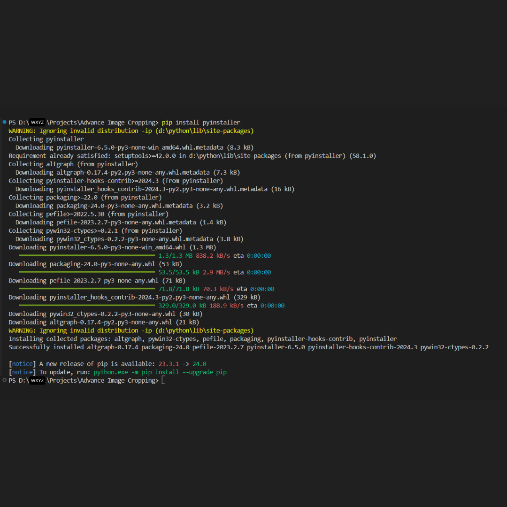
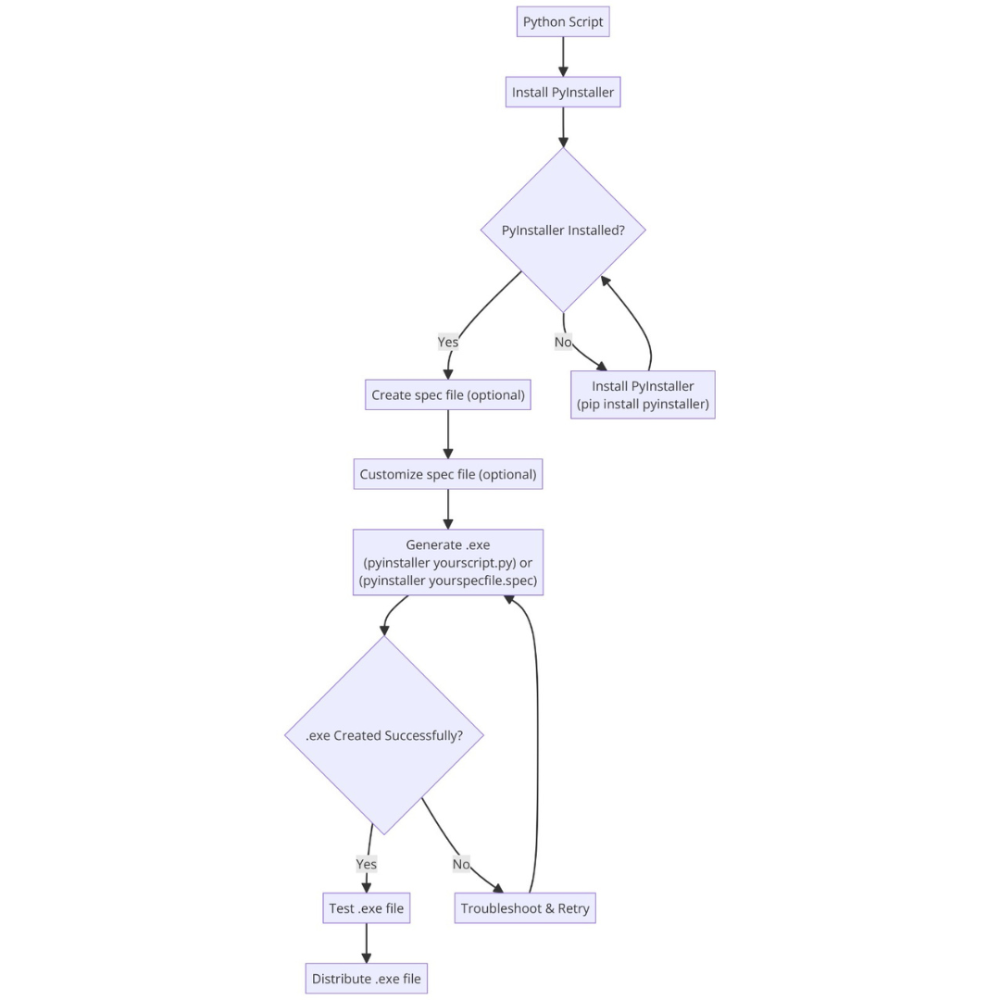

---

---

<h2 id="introduction">Introduction:</h2>

Distributing your Tkinter projects as <strong>.exe setup files</strong> is crucial for making them accessible to a wider audience, especially for users who may not have Python installed. This tutorial will take you step-by-step through the procedure. If you’re wondering <strong>how to make .exe setup file for your tkinter projects using</strong> tools like <strong>PyInstaller</strong> or <strong>auto-py-to-exe</strong>, you’re in the right place. Let’s dive in!

<h2 id="setting-up-the-environment">Setting Up the Environment:</h2>

Before you embark on converting your Tkinter project to a .exe file, ensure you have Python installed on your system. If not, head over to <a href="https://www.python.org/downloads/">Python’s official website</a> and download the latest version. Installing Python is the first step in the journey of <strong>converting Python program to exe</strong>.

Tip: Ensure you're installing Python for all users if you anticipate multiple users on the system.

<h2 id="developing-your-tkinter-project">Developing Your Tkinter Project</h2>

Now comes the fun part—developing your Tkinter application! Whether you’re building a simple calculator or a complex data visualization tool, ensure that your Tkinter project encompasses all the necessary functionality. This involves creating the user interface, adding buttons, text fields, and any other widgets your application requires. Properly structuring your project and including all dependencies from the start will streamline the conversion process later on. If you’re wondering <strong>how to convert Python program to exe</strong>, the key lies in having a well-structured Tkinter project.

Let’s consider an example of an Image Cropping application developed using Tkinter’s widgets and buttons.

 
<em>Figure 1: Diagram illustrating Tkinter project example.</em>

Caution: Be mindful of dependencies and versions, as they can affect the compatibility of your .exe file.

Properly organizing your project directory is essential for the packaging process. Here’s an example directory structure for your Tkinter project:

<pre><code>project/
│
├── main.py
├── assets/
│   ├── images/
│   │   └── logo.png
│   └── fonts/
│       └── font.ttf
│
└── other_files...
</code></pre>

Ensure that all your source code, images, fonts, and other resources are located within the project directory.

<h2 id="installing-pyinstaller">Installing PyInstaller</h2>

Once Python is installed, you’ll need to install the necessary tools like PyInstaller for the conversion process. <strong>PyInstaller</strong> is the go-to tool for converting Python scripts to standalone executables. Launch the command line interface, then enter: Installing PyInstaller is straightforward—simply use pip:

<pre class=" language-bash"><code class="prism  language-bash">pip install pyinstaller
</code></pre>

This command will fetch and install the latest version of PyInstaller from the Python Package Index (PyPI). PyInstaller will be your main tool in the process of <strong>converting tkinter to exe</strong>.

Note: Ensure you have administrative privileges when installing PyInstaller to avoid any installation errors.

 
<em>Figure 2: Diagram illustrating pyinstaller installation.</em>

Now that you have PyInstaller set up, let’s proceed to the conversion process.

<h2 id="converting-your-tkinter-project-to-a-.exe-file">Converting Your Tkinter Project to a .exe File:</h2>

With PyInstaller installed, converting your Tkinter project to a .exe file is a breeze. Navigate to the directory containing your Python script in the command line interface and run PyInstaller with the following command:

<pre class=" language-bash"><code class="prism  language-bash">pyinstaller your_script.py
</code></pre>

Your Python script’s name should be substituted for <code>your_script.py</code>. PyInstaller will analyze your script, gather all its dependencies, and create a standalone executable file (.exe) in the <code>dist</code> directory within your project folder. This executable file can be distributed and run on any Windows system without requiring Python to be installed.

Another way of Converting Your Tkinter Project to a .exe File:

<h3 id="creating-the-.spec-file">Creating the .spec File</h3>

The .spec file is a configuration file used by pyinstaller to build the executable. To create the .spec file, navigate to your project directory in the terminal and run the following command:

<pre class=" language-bash"><code class="prism  language-bash">pyi-makespec --onefile --windowed main.py
</code></pre>

This command will generate a <code>main.spec</code> file in your project directory.

<h3 id="editing-the-.spec-file">Editing the .spec File</h3>

Once you’ve generated the <strong>.spec</strong> file, you’ll need to make some modifications to include additional resources and dependencies. Open the <code>main.spec</code> file in a text editor and make the following changes:

<pre class=" language-python"><code class="prism  language-python"># main.spec

# Add pathex to include additional directories
pathex=['path/to/your/assets']

# Modify datas to include any additional files needed by your application
datas=[
    ('assets/images/', 'assets/images/'),
    ('assets/fonts/', 'assets/fonts/')
]

# Uncomment the following line to include icon resources
# icon='path/to/your/icon.ico'
</code></pre>
<h3 id="generating-the-.exe-setup-file">Generating the .exe Setup File</h3>

With the .spec file configured, you’re ready to generate the .exe setup file. Execute the subsequent command within the terminal:

<pre class=" language-bash"><code class="prism  language-bash">pyinstaller main.spec
</code></pre>

Pyinstaller will now bundle your Tkinter project and its dependencies into a single executable file. Once the process is complete, you’ll find the .exe setup file in the <code>dist</code> directory. If you encounter any errors or issues during the conversion process, don’t worry—we’ll address them shortly.

 
<em>Figure 3: Diagram illustrating step-by-step process of converting a Python script to a .exe file using PyInstaller.</em>

<h2 id="customizing-the-.exe-setup-file">Customizing the .exe Setup File:</h2>

Now that you have your .exe setup file generated, it’s time to customize it to match your application’s branding and style. You can add custom icons and metadata to the .exe file to make it visually appealing and easily recognizable. Additionally, you can configure settings such as the window size, title, and other properties to enhance the user experience.

To add a custom icon to your .exe file, simply include the path to your icon file when running PyInstaller:

<pre class=" language-bash"><code class="prism  language-bash">pyinstaller --icon=your_icon.ico your_script.py
</code></pre>

Replace <code>your_icon.ico</code> with the path to your icon file. This will embed the specified icon into your .exe file, giving it a unique identity. Similarly, you can customize other aspects of the .exe file to suit your preferences and requirements.

Tip: Use high-resolution icons for better visual quality on high-DPI displays.

<h2 id="testing-the-.exe-setup-file">Testing the .exe Setup File:</h2>

Before distributing your Tkinter application, it’s crucial to thoroughly test the generated .exe file to ensure it functions as expected. Run the .exe file on your own system to verify that it launches without errors and behaves correctly.

Even with careful preparation, you may encounter errors during the packaging process.

<h3 id="the-following-common-mistakes-and-their-fixes-are-listed">The following common mistakes and their fixes are listed:</h3>
<h4 id="error-1-importerror-no-module-named-tkinter">Error 1: ImportError: No module named ‘tkinter’</h4>

<strong>Solution:</strong> Ensure that Tkinter is installed. If you’re using Python 2, it’s called <code>Tkinter</code> with a capital ‘<strong>T</strong>’. For Python 3, it’s <code>tkinter</code>.

<h4 id="error-2-filenotfounderror-errno-2-no-such-file-or-directory-pathtoyourfile">Error 2: FileNotFoundError: [Errno 2] No such file or directory: ‘path/to/your/file’</h4>

<strong>Solution:</strong> Double-check the paths in your .spec file and make sure they point to the correct directories.

Additionally, test the .exe file on different Windows systems to ensure compatibility across various configurations. This will help identify any potential issues or dependencies that may arise on different systems. By conducting comprehensive testing, you can address any issues proactively and provide a seamless experience for your users.

It’s crucial to test your <strong>.exe</strong> setup file thoroughly on different platforms to ensure compatibility and functionality. Here are some testing steps you can follow:

<h4 id="for-windows">For Windows:</h4>
<ul>
<li>Run the <strong>.exe</strong> file on various <strong>Windows</strong> versions, including older versions if possible.</li>
<li>Check to make sure all features and capabilities perform as intended.</li>
</ul>
<h4 id="for-macos">For macOS:</h4>
<ul>
<li>Test the application on <strong>macOS</strong> using compatibility tools like <strong>Wine</strong> or by running it on a <strong>macOS</strong> system.</li>
<li>Check to make sure all features and capabilities perform as intended.</li>
</ul>
<h4 id="for-linux">For Linux:</h4>
<ul>
<li>Test the application on <strong>Linux</strong> using compatibility tools like <strong>Wine</strong> or by running it on a <strong>Linux</strong> system.</li>
<li>Check to make sure all features and capabilities perform as intended.</li>
</ul>

Caution: Some antivirus software may flag .exe files as potentially harmful. Inform users to whitelist your application if necessary.

<h2 id="distributing-your-tkinter-application">Distributing Your Tkinter Application:</h2>

Once you’ve tested your .exe setup file and confirmed its functionality, it’s time to distribute your Tkinter application to your target audience. Package the .exe setup file along with any additional resources such as images, data files, or documentation that your application may require.

There are several distribution channels you can explore, including <strong>direct downloads</strong> from your website, <strong>GitHub releases</strong>, or third-party platforms such as the <strong>Microsoft Store</strong> or <strong>Steam</strong>. Choose the distribution method that best suits your project and audience, ensuring that your application reaches as many users as possible.

Note: Consider utilizing multiple distribution channels to reach a broader audience, such as software aggregation websites or app marketplaces.

<h2 id="conclusion">Conclusion:</h2>

You’ve achieved the creation of a .exe setup file for your Tkinter project using PyInstaller. This comprehensive guide has equipped you with the skills to convert Python GUI applications into standalone executables, enabling wider distribution and accessibility for your Tkinter projects.

Now that you have the tools and knowledge to convert your Python GUI applications into standalone executables, you can share your creations with the world and make an impact in the software development community. Keep exploring and innovating.

Tip: Encourage users to provide feedback on their experience with your application. User feedback is invaluable for improving future releases.

<h2 id="additional-tips-and-resources">Additional Tips and Resources:</h2>
<ul>
<li>

<strong>Optimizing Size and Performance:</strong> Consider using <strong>UPX</strong> to further compress your .exe file and improve performance. UPX is a free, open-source executable packer that can significantly reduce the size of your executable files without affecting their functionality. By compressing your .exe file with UPX, you can minimize download times and conserve bandwidth, especially for users with slower internet connections.

</li>
<li>

<strong>Further Reading:</strong> For more in-depth tutorials on packaging Tkinter applications, check out <a href="https://realpython.com/python-gui-tkinter/#building-executables-with-pyinstaller">Real Python’s guide on building executables with PyInstaller</a>. Real Python offers a wealth of resources and tutorials for Python developers of all skill levels, covering topics ranging from web development to data science.

</li>
<li>

<strong>Recommended Tools:</strong> While PyInstaller is an excellent choice for converting Python scripts to standalone executables, you may also want to explore alternatives like <strong>auto-py-to-exe</strong>. Auto-py-to-exe is a user-friendly GUI interface for PyInstaller that simplifies the conversion process and provides additional customization options. Whether you’re a beginner or an experienced developer, auto-py-to-exe can streamline the process of creating .exe setup files for your Tkinter projects.

</li>
</ul>

