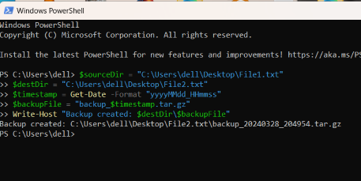

In this guide, we'll explore automation with Python. Automation is key in today's fast-paced world, saving time and effort across various tasks. **Python**, which is a top choice for **Automation**. We'll cover its essential libraries, practical uses, and best practices. By the end, you'll be ready to automate tasks efficiently using Python.

# Understanding Automation

Automation with Python offers a transformative approach to **streamlining repetitive tasks** and **optimizing workflows** across industries. 

## What is automation

**Automation** is the use of technology to perform tasks with minimal human intervention. It involves the implementation of systems or processes that can **operate automatically**, **reducing the need for manual labor** and **increasing efficiency**. 
Examples of automation include **robotic assembly lines** in manufacturing, **automated email responses** in customer service, and **self-driving vehicles** in transportation. 

## Why Automation is Important and Required:

-   **Efficiency:** Streamlines processes, saving time and effort.
-   **Accuracy:** Minimizes human error, ensuring precision.    
-   **Cost Reduction:** Lowers labor costs, increases productivity.    
-   **Scalability:** Adapts easily to changing demands.     
-   **Productivity:** Frees up time for strategic work.     
-   **Data Analysis:** Provides valuable insights for decision-making.    
 
## Introduction of Python in  Automation

Python is a powerful language for automation tasks due to its **simplicity**, **versatility**, and **extensive libraries**. 

## Python Modules for Automation

Given below are the python Modules to automate various tasks such as **file operations**, **web scraping**, **data manipulation**, **system administration**, and more.

**1. Selenium :** A powerful tool for automating web browsers, which allows you to interact with web elements, fill forms, and navigate through web pages programmatically. 

**uses** : It's widely used for **web scraping**, **testing** and **fill forms**  in web applications.

    from selenium import webdriver
    from selenium.webdriver.common.by import By
    from selenium.webdriver.common.keys import Keys
    import time
    
    driver = webdriver.Chrome()
    driver.get("https://www.google.com")
    search_input = driver.find_element(By.NAME, "q")  # Google's search input element name is "q"
    
    search_input.send_keys("Python automation")
    search_input.send_keys(Keys.RETURN)
    
    time.sleep(60)
    driver.quit()

![selenium][1] ![selenium][2]

**2. PyAutoGUI :** This enables you to automate GUI interactions by simulating mouse and keyboard actions.

**uses** : It is useful for automating tasks involving graphical user interfaces, such as opening applications

    import pyautogui
    import time
    try:
        pyautogui.press('win')
        pyautogui.write('notepad')
        pyautogui.press('enter')
        time.sleep(4)  # Wait for Notepad to open
    
        pyautogui.write('Hello')
        time.sleep(2)  # Let's type slowly for demonstration
        pyautogui.hotkey('ctrl', 's')
        time.sleep(4)  # Wait for Save As dialog to open
        pyautogui.write('Hello.txt')
        time.sleep(2)  
        pyautogui.press('enter')
        time.sleep(2)  
    
        print("Task completed successfully!")
    except Exception as e:
        print("An error occurred:", e)

![pyautogui1][3]

![pyautogui2][4]

![pyautogui3][5]

**3. Requests :** A is a simple yet elegant **HTTP library** for Python, which allows you to send HTTP requests easily. 

**uses :** It's commonly used for web scraping, **accessing APIs**.
  
    import requests
    try:
      response = requests.get("https://www.google.com")
      if response.status_code == 200:
          print("Request to Google successful!")
          print("HTML Content:")
          print(response.text)
      else:
          print("Failed to retrieve data from Google. Status code:", response.status_code)
    except Exception as e:
      print("An error occurred:", e)

![request][6]

**4. Beautiful Soup :** This library provides functions for **parsing HTML and XML documents**, making it invaluable for web scraping tasks.

**uses** : It allows you to extract data from web pages effortlessly, facilitating     automation of data extraction processes.

    from bs4 import BeautifulSoup
    import requests
    
    response = requests.get("https://www.example.com")
    #Parse the HTML content
    soup = BeautifulSoup(response.content, "html.parser")
    for link in soup.find_all("a"):
        print(link.get_text())

![beautiful][7]  
    
**5. Pandas :** Pandas is a powerful data manipulation library that provides high-level data structures and functions for working with structured data. 

**uses :** It's commonly used for automating data processing tasks, such as cleaning, transforming, and analyzing datasets.
    
     import pandas as pd
     data = {
        'Name': ['Alice', 'Bob', 'Charlie', 'David'],
        'Age': [25, 30, 35, 40],
        'City': ['New York', 'Los Angeles', 'Chicago', 'Houston']
      }
    df = pd.DataFrame(data)
    print("DataFrame:")
    print(df)

![dataframe][8]

# Getting Started with Automation

## How to Automate a Task: A Step-by-Step Guide

**Step 1: Identify Task**

Identify a task that is repetitive and time-consuming, such as organizing files in a directory based on their types.

**Step 2: Divide the Task into Smaller Steps**

Break down the task into smaller, manageable steps. For instance:
-   Identify all file types present in the directory.
-   Create separate folders for each file type.
-   Move files into their respective folders based on their types.

**Step 3: Research Python Libraries**

Research Python libraries that can assist in automating each step of the task. For our example, you might consider libraries like os for file operations and shutil for moving files.

**Step 4: Write the Code**

Write Python code to automate each step of the task. Here's an example:

    import os
    import shutil
    #Step 1: Identify all file types present in the directory
    file_types = set()
    for filename in os.listdir('directory_path'):
        if os.path.isfile(filename):
            file_types.add(filename.split('.')[-1])
    #Step 2: Create separate folders for each file type
    for file_type in file_types:
        os.makedirs(file_type, exist_ok=True)
    #Step 3: Move files into their respective folders based on their types
    for filename in os.listdir('directory_path'):
        if os.path.isfile(filename):
            file_type = filename.split('.')[-1]
            shutil.move(filename, os.path.join(file_type, filename))
        
**Step 5: Test the Code**

Test the code with sample data to ensure that it performs as expected. Verify that files are organized correctly into their respective folders.

![flow1][9] ![flow2][10] 
![flow3][11]

**Step 6: Update the Code**

Refine and update the code as needed based on test results and feedback. Ensure it handles edge cases and exceptions gracefully.

# Introduction to Automation Scripting Languages

Scripting and automation have become **indispensable** tools for individuals and organizations alike. 

**Understanding Automation Scripting Languages:**

Automation scripting languages are programming languages specifically designed to automate repetitive tasks, system operations, and processes. These languages provide a set of syntax and functionalities tailored for automating various tasks efficiently.

**Characteristics of Automation Scripting Languages:**

1.  **Readable Syntax**: Clear and concise code for easier comprehension.
2.  **Abundance of Libraries**: Extensive pre-built functions streamline development.
3.  **Interpretation or Compilation**: Code execution either directly (interpreted) or translated into machine language (compiled).
4.  **Cross-Platform Compatibility**: Capable of running on various operating systems. 

**Popular Automation Scripting Languages:**

1.  **Python**: Versatile, with rich libraries; used for automation, web dev, and data analysis.
2.  **Bash (Shell)**: Default on Unix; excels in system tasks and command-line ops.
3.  **PowerShell**: Microsoft's automation tool for Windows; robust system management.

## Why Python is an ideal choice for automation

In this brief overview, we'll explore why **Python** stands out as the optimal language for automation tasks.

1.  **Simplicity**: Python's clear syntax reduces development time.
2.  **Versatility**: It spans multiple domains, easing the learning curve.
3.  **Rich Ecosystem**: Abundance of automation libraries streamline tasks.
4.  **Cross-Platform Compatibility**: Runs seamlessly on various operating systems. 
5.  **Community Support**: Large developer community offers abundant resources. 
6.  **Integration Capabilities**: Easily integrates with other languages and tools.

# Essential Python Libraries for Automation

##  OS Module

The `os` module in Python provides a **platform-independent** way of interacting with the **operating system**, offering functions for various operating system-related tasks such as **file and directory operations**, **process management**.

**Example :**

    import os
    cwd = os.getcwd()
    print("Current directory:", cwd)
    
    new_dir = os.path.join(cwd, 'new_directory')
    if not os.path.exists(new_dir):
        os.makedirs(new_dir)
        print("New directory created:", new_dir)
    else:
        print("Directory already exists:", new_dir)
    
    files = os.listdir(cwd)
    print("Files in current directory:", files)
    
    old_file = os.path.join(cwd, 'old_file.txt')
    new_file = os.path.join(cwd, 'new_file.txt')
    os.rename(old_file, new_file)
    print("File renamed from 'old_file.txt' to 'new_file.txt'")

![os_module][12]

 Note: While renaming the files make sure to create the file whose name you want to change. 

## Shutil Module

The `shutil` module offers a high-level interface for **file operations**, including file **copying**, **moving**, and **deletion**.

**Example :**

    import shutil
    source_file = 'C:\\Users\\dell\\Desktop\\temp\\source.txt'
    destination_file = 'C:\\Users\\dell\\Desktop\\temp\\destination.txt'
    
    try:
        shutil.copy(source_file, destination_file)
        print("File copied successfully!")
    except FileNotFoundError:
        print("Source file not found.")
    except PermissionError:
        print("Permission denied.")
    except Exception as e:
        print("An error occurred:", e)

![shutil_module][13]

 Note: Make sure to pass the correct path of the source and destination file in the same way as mentioned above. 

## Subprocess Module

The `subprocess` module in Python provides a powerful way to **spawn** new processes, connect to their input/output/error pipes, and obtain their return codes. It allows you to execute system commands, run external programs, and interact with them programmatically from within your Python script.

**Example :**

    import subprocess
    try:
        #Run the command and capture output
        result = subprocess.run(['-l'], capture_output=True, text=True)
        # Print the command output
        print("Command output:", result.stdout)
    except FileNotFoundError:
        print("Command not found.")
    except Exception as e:
        print("An error occurred:", e)

![subprocess_module][14]

## Time  and  Datetime Modules

The `time` and `datetime` modules in Python provide functionalities for handling time-related tasks, including measuring time intervals, formatting dates and times, and scheduling automation jobs.

**Example :**

    import time
    delay = 5
    start_time = time.time()
    while time.time() < start_time + delay:
        pass
    print("Automation job executed after {} seconds.".format(delay))

![time_date][15]

 Note: When this code is executed than after the delay of 5 seconds the message is displayed 

# Web Scraping and Automation

Web scraping and automation, in particular, empower users to automate repetitive tasks and extract valuable data from websites automatically. By utilizing automation scripts, users can interact with web pages, submit forms, extract data, and perform various other tasks, thereby optimizing web-based workflows and saving time and effort.

**Automating Web Tasks**

Automation scripts can interact with web pages, submit forms, extract data, and perform other tasks, enabling the automation of web-based workflows.

 **Example**

    import requests
    from bs4 import BeautifulSoup
    #Define the URL of the webpage
    url = "https://www.example.com"
    try:
      response = requests.get(url)
      if response.status_code == 200:
          print("Webpage accessed successfully!")
          soup = BeautifulSoup(response.text, 'html.parser')
          links = soup.find_all('a')
          for link in links:
              print(link.text)
          # For example, submitting a login form
          payload = {'username': 'your_username', 'password': 'your_password'}
          login_response = requests.post('https://www.example.com/login', data=payload)
          if login_response.status_code == 200:
              print("Login successful!")
          else:
              print("Login failed.")
      else:
          print("Failed to access the webpage.")
    except Exception as e:
      print("An error occurred:", e)

![web_scrap][16]

# Automating System Tasks

Automating system tasks involves streamlining repetitive processes on both **Windows** and **Linux** operating systems, enhancing **productivity** and **efficiency**.

## Task Automation on Windows and Linux

- On **Windows**, PowerShell is a powerful automation tool that provides a wide range of cmdlets and scripts for managing system tasks. With **PowerShell**, you can automate tasks such as **file manipulation**, **registry editing**, **user management**, and **system configuration**.
- On Linux, shell scripting with **Bash** is commonly used for automating system tasks. Bash scripts can perform tasks such as **directory traversal**, **process management**, and **system monitoring**.

**Example :**
**Windows**

    $sourceDir = "C:\Users\dell\Desktop\File1.txt"
    $destDir = "C:\Users\dell\Desktop\File2.txt"
    
    $timestamp = Get-Date -Format "yyyyMMdd_HHmmss"
    $backupFile = "backup_$timestamp.tar.gz"

    Compress-Archive -Path $sourceDir -DestinationPath "$destDir\$backupFile"
    Write-Host "Backup created: $destDir\$backupFile"

# Data Processing and Automation

## Introduction to Data Processing

Data processing is the method of transforming raw data into valuable information or insights. It involves several stages such as data collection, cleaning, transformation, analysis, and visualization. Automation accelerates data processing pipelines by reducing manual intervention, minimizing errors, and improving efficiency and scalability. 

## Using Pandas for Data Automation

When we use `Pandas` for data automation allows for efficient **processing**, **manipulation**, and **analysis** of data in Python. `Pandas` is a powerful library that provides data structures such as `DataFrame` and **Series**.

**Example :**

    import pandas as pd
    data = pd.read_csv('data.csv')
    data.head(7)
    df = pd.DataFrame(data)
    df.head()
    missing_values = df.isna().sum()
    print(missing_values)
    df_filled = df.fillna(0)
    df_filled.head(7)

![panda1][17] ![panda2][18]

# Testing and Automation

**Testing** and **automation** are crucial aspects of software development, ensuring **software reliability** and **quality**. Testing involves systematically evaluating software to find defects, while automation utilizes tools and scripts to execute tests efficiently.

## Overview of Testing Automation

Testing automation involves the use of software tools and frameworks to automate the process of testing software applications. One popular testing automation framework is `pytest`.

## Using pytest for Testing Automation

**Pytest** is a popular testing framework in Python known for its **simplicity** and **scalability**. It offers powerful features for writing and executing test cases efficiently. With `pytest`, developers can easily create **test functions**, **organize test suites**, and **assert expected outcomes**, making it suitable for both **small** and **large-scale projects**.

**Example :**

    class Calculator:
        def add(self, a, b):
            return a + b
       def subtract(self, a, b):
             return a - b
    calculator = Calculator()
    def test_addition():
        assert calculator.add(2, 3)==5
        assert calculator.add(5, -1)==4
    def test_subtraction():
        assert calculator.subtract(5, 3)==2
        assert calculator.subtract(10, 7)==3

![py_test][19]

**NOTE:** Always save your `pytest` file with the following naming convention that is `test_filename`

# Real-World Automation Examples

- **Backup Automation**: Schedule regular backups of critical data to prevent loss in case of hardware failure or data corruption.
- **Server Maintenance**: Automate routine server maintenance tasks such as software updates, disk cleanup, and system reboots.
- **Report Generation**: Automatically generate and distribute reports on a scheduled basis, reducing manual effort and ensuring timely delivery.
- **Email Automation**: Implement automated email responses, email filtering, and email forwarding to streamline communication processes.
- **Data Migration**: Automate the migration of data between databases or cloud storage solutions to ensure accuracy and efficiency.
- **Customer Support**: Implement chatbots or automated ticketing systems to handle common customer inquiries and support requests.

# Conclusion

In conclusion, **Automation** with **Python** empowers individuals and organizations to **streamline workflows**, increase **productivity**, and **drive innovation**. By leveraging Python's simplicity, versatility, and rich ecosystem of libraries, automation enthusiasts can automate tasks across diverse domains, from **file operations** and **web scraping** to **system administration** and **data processing**. Remember to explore further, experiment with different libraries and tools, and apply best practices to create **efficient**, **reliable** automation solutions.

  [1]: https://logiclair.org/?qa=blob&qa_blobid=15838233321585473441
  [2]: https://logiclair.org/?qa=blob&qa_blobid=9123795144558585525
  [3]: https://logiclair.org/?qa=blob&qa_blobid=14912766778711305660
  [4]: https://logiclair.org/?qa=blob&qa_blobid=2396116423201933139
  [5]: https://logiclair.org/?qa=blob&qa_blobid=6172482470636820611
  [6]: https://logiclair.org/?qa=blob&qa_blobid=13033853441911983193
  [7]: https://logiclair.org/?qa=blob&qa_blobid=2098310934623573145
  [8]: https://logiclair.org/?qa=blob&qa_blobid=11465619741529268881
  [9]: https://logiclair.org/?qa=blob&qa_blobid=12988320224929339783
  [10]: https://logiclair.org/?qa=blob&qa_blobid=12229359629986255120
  [11]: https://logiclair.org/?qa=blob&qa_blobid=14061471290674041970
  [12]: https://logiclair.org/?qa=blob&qa_blobid=14821207025398722810
  [13]: https://logiclair.org/?qa=blob&qa_blobid=5755817284276135819
  [14]: https://logiclair.org/?qa=blob&qa_blobid=13235046775727453611
  [15]: https://logiclair.org/?qa=blob&qa_blobid=7133510508519989931
  [16]: https://logiclair.org/?qa=blob&qa_blobid=13203608641888015506
  [17]: https://logiclair.org/?qa=blob&qa_blobid=15419402808891249462
  [18]: https://logiclair.org/?qa=blob&qa_blobid=17675462299952413712
  [19]: https://logiclair.org/?qa=blob&qa_blobid=7916416413820548395
