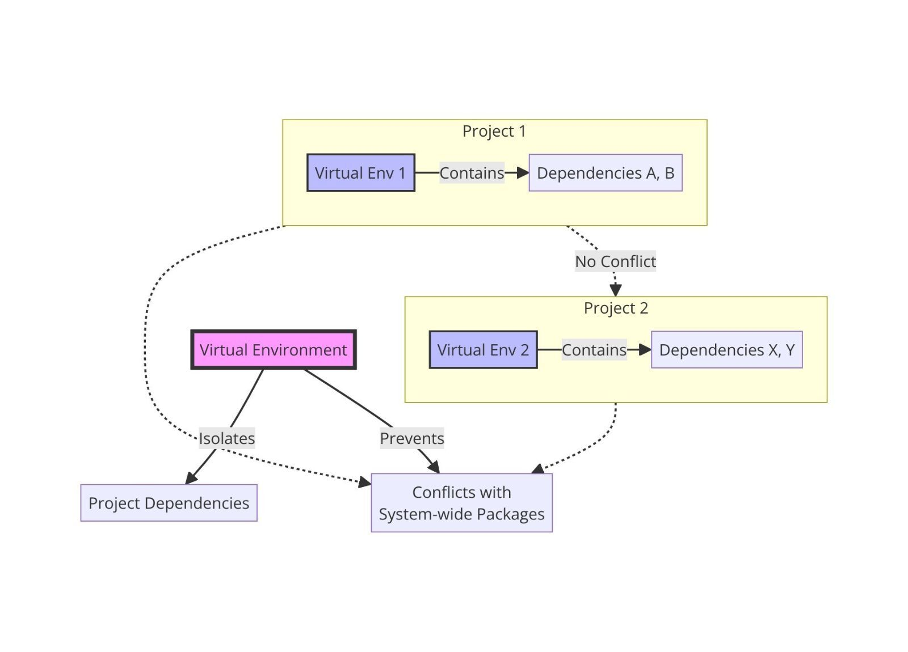
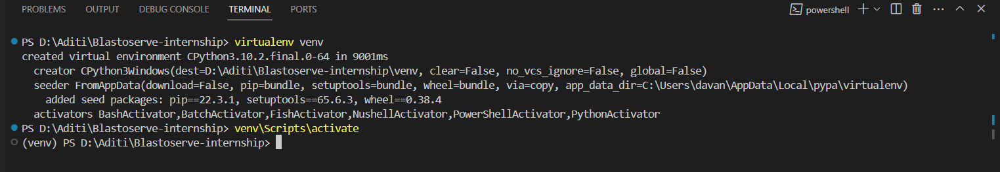
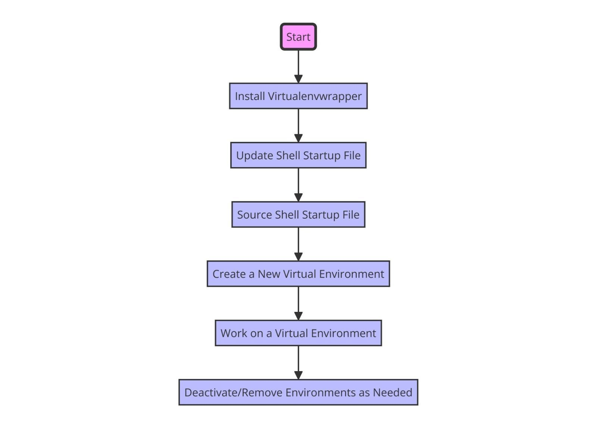
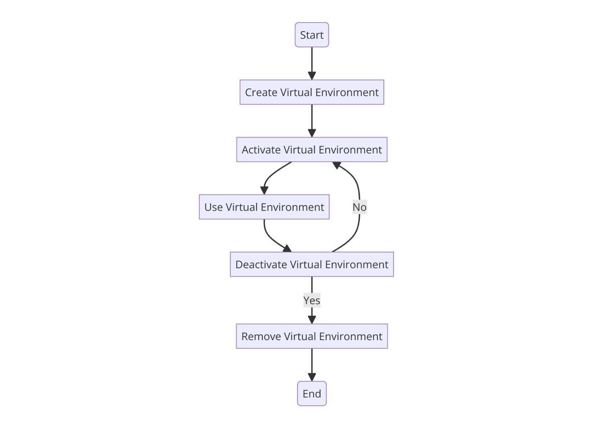
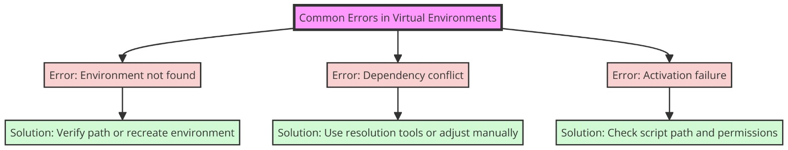

Setting up a virtual environment in Python for project development does provide a streamlined approach to managing project dependencies and ensuring a clean development environment. It is used when you want to isolate Python packages and dependencies for each project, preventing conflicts and ensuring reproducibility.

Embarking on a Python project journey feels exhilarating, doesn't it? But amidst the excitement, it's essential to lay down a sturdy foundation. Let's dive into the world of virtual environments and unlock the potential they hold for seamless project development.


## Understanding Virtual Environments

Before we dive into setting up virtual environments, let’s understand why they are necessary. Using pip, you may install  [Python](https://docs.python.org/3/tutorial/venv.html) packages globally, which makes them **accessible** to all Python applications running on your machine. While this might seem convenient, it can lead to conflicts between different project dependencies, especially when projects require different versions of the same package.

This issue is resolved with virtual environments, which separate environments for every project. Every virtual environment has a different package installation directory and Python interpreter. This **isolation** ensures that packages installed in one environment do not interfere with packages in another.


*Figure 1: Diagram illustrating the concept of virtual environments.*

## Step-by-Step Guide to Setting up Virtual Environments

**Step 1: Installing Virtualenv**

The first step is to install virtualenv, a tool used to create virtual environments. You can install it using pip:

```bash
pip install virtualenv
```

**Step 2: Creating a Virtual Environment**

Open the project directory and use virtualenv to establish a virtual environment:

```bash
cd your_project_directory
virtualenv venv
```

Replace `your_project_directory` with the path to your project. The virtual environment is created in a directory called `venv` that is created in your project directory by this command.

**Step 3: Activating the Virtual Environment**

You must activate the virtual environment when it has been established. Activation alters the shell prompt to show the active environment and sets up the environment variables. On Windows, run:

```bash
venv\Scripts\activate
```

On Unix or MacOS, run:

```bash
source venv/bin/activate
```

*Figure 2: Diagram illustrating command-line interface (CLI) with commands.*

You’ll notice that your command prompt changes, indicating that the virtual environment is active.

**Step 4: Installing Dependencies**

Once the virtual environment is up and running, use pip to install Python packages tailored to your project:

```bash
pip install package_name
```

The package name that you wish to install should be substituted for `package_name`.

**Step 5: Deactivating the Virtual Environment**

After completing your project, you can use the following command to end the virtual environment:

```bash
deactivate
```
This command ends the virtual environment and returns your shell to its initial settings.

## Managing Virtual Environments with Virtualenvwrapper

While virtualenv is adequate for managing virtual environments on a basic level, [Virtualenvwrapper](https://virtualenvwrapper.readthedocs.io/en/latest/) offers more functionality and streamlines the process. It allows you to create, delete, and manage virtual environments with ease. Here’s how to set up virtualenvwrapper:

**Step 1: Installing Virtualenvwrapper**

Install virtualenvwrapper via pip:

```bash
pip install virtualenvwrapper
```

**Step 2: Configuring Virtualenvwrapper**

Add the following lines to your shell startup file (e.g., `.bashrc`, `.bash_profile`, or `.zshrc`):

```bash
export WORKON_HOME=$HOME/.virtualenvs
source /usr/local/bin/virtualenvwrapper.sh
```

Replace `/usr/local/bin/virtualenvwrapper.sh` with the path to the `virtualenvwrapper.sh` script on your system.

**Step 3: Creating and Managing Virtual Environments**

Once virtualenvwrapper is installed and set up, you can use these few commands to build and administer virtual environments:

- **Creating a Virtual Environment:**

```bash
mkvirtualenv my_project
```

This command creates a virtual environment named `my_project`.

- **Activating a Virtual Environment:**

```bash
workon my_project
```

This command activates the virtual environment named `my_project`.

- **Deactivating a Virtual Environment:**

```bash
deactivate
```

This command deactivates the currently active virtual environment.

- **Listing Available Virtual Environments:**

```bash
lsvirtualenv
```

This command lists all available virtual environments.

- **Removing a Virtual Environment:**

```bash
rmvirtualenv my_project
```
This command deletes the virtual environment named `my_project`.


*Figure 3: Diagram illustrating configuration of VirtualEnvWrapper*

## Best Practices for Virtual Environment Management

**1. Use Requirements Files**

To maintain a record of project dependencies, use `requirements.txt` files. These files list all project dependencies and their versions, making it easy to recreate the environment on another system.

```bash
pip freeze > requirements.txt
```

To install dependencies from a `requirements.txt` file:

```bash
pip install -r requirements.txt
```

**2. Include Virtual Environment in Version Control**

Add the virtual environment directory (`venv` or `.venv`) to the version control system for your project. By doing this, it is made possible for other developers to work on the project in an identical setting.

**3. Update Packages Regularly**

Regularly update your project’s dependencies to ensure you’re using the latest versions of packages. You can use pip to update packages:

```bash
pip install --upgrade package_name
```

**4. Document Dependencies**

Project dependencies should be listed in a README file along with their version numbers and purpose. This aids partners in comprehending the needs of the project and configuring their surroundings appropriately.


*Figure 4: Diagram illustrating best practices*

<div class="div-green"> <span class="alert-header">Tips:</span>Explore tools like `pipreqs` or `pip-tools` to automatically generate `requirements.txt` files based on your project's dependencies. This ensures accurate documentation of dependencies and simplifies environment replication.</div>

## How to Solve Commonly Occurring Errors in Virtual Environments in Python

Virtual environments are essential for managing Python project dependencies, but they can sometimes lead to errors that can be frustrating to debug. In this guide, we’ll explore some of the most commonly occurring errors in virtual environments and provide solutions to troubleshoot them effectively.

### 1. ImportError: No module named…

This error occurs when the Python interpreter cannot find the specified module within the virtual environment. To resolve this issue:

-   **Check Installation**: Ensure that the module is installed within the virtual environment using  `pip install`.
    
-   **Activate the Virtual Environment**: Make sure that the virtual environment is activated. If not, activate it using the appropriate command (`source venv/bin/activate`  on Unix/MacOS or  `venv\Scripts\activate`  on Windows).
    
-   **Check PYTHONPATH**: Verify that the module is not being overridden by the  `PYTHONPATH`  environment variable.
    

<div class="div-blue"> <span class="alert-header">Note:</span> Always double-check the spelling and case sensitivity of the module name and ensure that the virtual environment is activated before installing or using any packages.</div>

### 2. ModuleNotFoundError: No module named…

Similar to  `ImportError`,  `ModuleNotFoundError`  indicates that the specified module cannot be found. To address this:

-   **Check Module Name**: Double-check the module name for typos or inconsistencies.
    
-   **Reinstall the Module**: If the module is installed globally but not in the virtual environment, reinstall it within the virtual environment using  `pip install`.
    
-   **Ensure Correct Python Interpreter**: Confirm that you’re using the correct Python interpreter associated with the virtual environment.
    

<div class="div-red"> <span class="alert-header">Caution:</span>  Avoid installing packages globally that are required only for specific projects to prevent `ModuleNotFoundError` issues.</div>

### 3. SyntaxError: invalid syntax

This error typically occurs when attempting to execute code with invalid syntax. Here’s how to troubleshoot it:

-   **Check Python Version**: Ensure that the virtual environment is using the correct Python version required by your code.
    
-   **Review Code**: Review the code where the error occurs and look for syntax errors such as missing colons, parentheses, or quotation marks.
    

<div class="div-green"> <span class="alert-header">Tip:</span> Use an integrated development environment (IDE) with syntax highlighting and error checking to catch syntax errors early in the development process.</div>

### 4. Permission Denied or Access Denied Errors

Permission denied errors may occur when attempting to execute scripts or access files within the virtual environment. To fix this:

-   **File Permissions**: Check and adjust the permissions of the files or directories causing the error.
    
-   **Run as Administrator**: On Windows, run the command prompt or terminal as an administrator to grant necessary permissions.
    

<div class="div-green"> <span class="alert-header">Tip:</span> Be cautious when changing file permissions, as it may compromise security or lead to unintended consequences.</div>

### 5. Command Not Found Errors

Command not found errors can occur when attempting to run scripts or executables within the virtual environment. To resolve this:

-   **Check PATH**: Ensure that the virtual environment’s  `bin`  directory is included in the  `PATH`  environment variable.
    
-   **Activate the Virtual Environment**: Make sure the virtual environment is activated before running commands or scripts.
    
<div class="div-green"> <span class="alert-header">Tip:</span> 
 Use absolute paths or specify the full path to scripts or executables to avoid `Command Not Found` errors. </div>

## Common Errors

Virtual environments are powerful tools for managing Python dependencies, but they can encounter errors from time to time. By understanding common errors and their solutions, you can effectively  **troubleshoot issues**  that arise within virtual environments and streamline your development process.


*Figure 5: Diagram illustrating common errors.*

## Additional Tips and Recommendations

In addition to the steps outlined above, here are some additional tips and recommendations to enhance your experience with virtual environments:

- **Use Shortcuts:** Assign shortcuts or aliases to frequently used commands for virtual environment management to streamline your workflow

- **Automate Environment Setup:** Consider automating the creation and setup of virtual environments using tools like `pipenv` or `conda` for more advanced project management.

- **Explore Environment Switching:** Experiment with tools like `pyenv` or `direnv` for managing multiple Python versions and automatically switching between environments based on project directories.

By incorporating these tips into your virtual environment setup, you can further improve productivity and maintain a clean and organized development environment.

<div class="div-green"> <span class="alert-header">Tip:</span> Periodically review and remove unused virtual environments to declutter your system and conserve disk space. Tools like `virtualenvwrapper` provide commands (`rmvirtualenv`) to easily delete environments that are no longer needed.</div>


## Conclusion

Setting up virtual environments in Python is essential for effective project development. By isolating dependencies, you can avoid conflicts and ensure consistent behavior across different environments. Whether you choose virtualenv or virtualenvwrapper, incorporating virtual environments into your workflow will streamline development and enhance collaboration.

