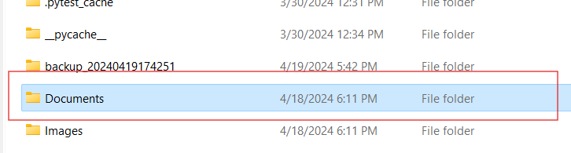
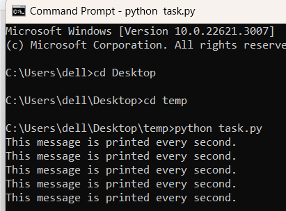
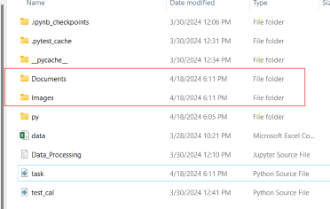
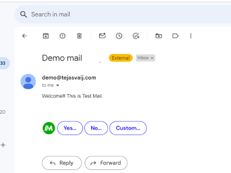
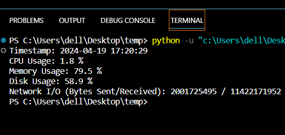
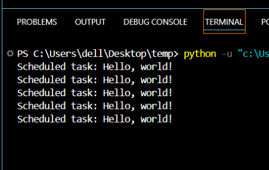

In this comprehensive guide, we embark on a journey into the realm of task automation using Python. We'll explore how Python can **streamline workflows** by automating repetitive tasks. From setup to practical examples, you'll learn **essential libraries**, **scheduling**, **testing**, and **deployment**.
# Task automation
Task automation enhances productivity by automating repetitive tasks, reducing manual effort, and minimizing errors. This allows organizations to streamline operations and redirect resources toward more valuable work. Automation tools like Python help businesses cut costs and improve efficiency, enabling teams to focus on innovation and growth.
## Why Python for Task Automation?
- **Simplicity**: Python's clear and easy-to-read syntax makes it ideal for automating tasks with minimal code complexity.  
- **Extensive Libraries**: A wealth of libraries, like `os`, `shutil`, `requests`, and `pandas`, provide tools for various automation tasks, from file management to data processing.  
- **Cross-Platform**: Python runs on multiple operating systems, allowing scripts to be used in diverse environments.  
- **Strong Community**: Python's large community offers extensive resources, tutorials, and support for automation-related queries.  
- **Integration-Friendly**: Python easily integrates with other tools, services, and technologies, allowing for flexible automation solutions.  
- **Rapid Prototyping**: Python's simplicity enables quick development and testing of automation scripts, allowing for rapid iteration and refinement.

# Getting Started with Python for Task Automation
## Setting Up the Python Environment
Here are the steps in short:

1.  **Install Python**: Download and install the latest version of Python from the official website ([https://www.python.org/downloads/](https://www.python.org/downloads/)). Make sure to add Python to the system PATH during installation.  
2.  **Choose an IDE**: Select an Integrated Development Environment (IDE) for Python development. Popular choices include PyCharm, Visual Studio Code, and IDLE. Download and install the preferred IDE.   
3.  **(Optional) Set up Virtual Environment**: Use Python's built-in `venv` module or a third-party tool like `virtualenv` to create isolated Python environments for your projects. This helps manage dependencies and avoids conflicts between different projects.  
4.  **Install Required Packages**: Use `pip`, the Python package manager, to install any additional packages or libraries you need for your projects. For example, you can install packages like `requests`, `beautifulsoup4`, or `pandas` using `pip install`.   
5.  **Test Your Setup**: Create a simple Python script and run it in your chosen IDE to ensure everything is set up correctly. You can print a "Hello, World!" message to verify that Python is installed and the IDE is configured properly.
## Writing Your First Automation Script
Let's create a simple Python script to automate a basic task, such as file management.

	#Simple Python Script for File Management
	import os
	
	def organize_files(directory):
	    for filename in os.listdir(directory):
	        if filename.endswith('.txt'):
	            # Move text files to a 'TextFiles' directory
	            os.rename(os.path.join(directory, filename), os.path.join(directory, 'TextFiles', filename))
	directory_path = 'C:\\Users\\dell\\Desktop\\temp'
	organize_files(directory_path)

# Essential Python Libraries for Automation

##  OS Module

The `os` module in Python provides a **platform-independent** way of interacting with the **operating system**, offering functions for various operating system-related tasks such as **file and directory operations**, **process management**.

**Example :**

    import os
    cwd = os.getcwd()
    print("Current directory:", cwd)
    
    new_dir = os.path.join(cwd, 'new_directory')
    if not os.path.exists(new_dir):
        os.makedirs(new_dir)
        print("New directory created:", new_dir)
    else:
        print("Directory already exists:", new_dir)
    
    files = os.listdir(cwd)
    print("Files in current directory:", files)
    
    old_file = os.path.join(cwd, 'old_file.txt')
    new_file = os.path.join(cwd, 'new_file.txt')
    os.rename(old_file, new_file)
    print("File renamed from 'old_file.txt' to 'new_file.txt'")

 Note: While renaming the files make sure to create the file whose name you want to change. 

## Shutil Module

The `shutil` module offers a high-level interface for **file operations**, including file **copying**, **moving**, and **deletion**.

**Example :**

    import shutil
    source_file = 'C:\\Users\\dell\\Desktop\\temp\\source.txt'
    destination_file = 'C:\\Users\\dell\\Desktop\\temp\\destination.txt'
    
    try:
        shutil.copy(source_file, destination_file)
        print("File copied successfully!")
    except FileNotFoundError:
        print("Source file not found.")
    except PermissionError:
        print("Permission denied.")
    except Exception as e:
        print("An error occurred:", e)

 Note: Make sure to pass the correct path of the source and destination file in the same way as mentioned above. 

## Subprocess Module

The `subprocess` module in Python provides a powerful way to **spawn** new processes, connect to their input/output/error pipes, and obtain their return codes. It allows you to execute system commands, run external programs, and interact with them programmatically from within your Python script.

**Example :**

    import subprocess
    try:
        #Run the command and capture output
        result = subprocess.run(['-l'], capture_output=True, text=True)
        # Print the command output
        print("Command output:", result.stdout)
    except FileNotFoundError:
        print("Command not found.")
    except Exception as e:
        print("An error occurred:", e)

## Scheduled Module
The `schedule` module in Python provides a simple and intuitive way to schedule recurring tasks and automate job execution. It allows you to define tasks to be executed at specific intervals, such as daily, hourly, or at a custom frequency. With `schedule`, you can automate repetitive tasks like data backups, report generation, and system maintenance effortlessly.

**Example :**

	import schedule
	import time

	def print_message():
	    print("This message is printed every second.")
	schedule.every(1).seconds.do(print_message)
	while True:
	    schedule.run_pending()
	    time.sleep(1)  # Wait for 1 second

# Automating File and Data Management
## File Organization and Cleanup
Automating file organization, renaming, and cleanup tasks can significantly improve efficiency and maintain a tidy file system. Python provides powerful tools for automating these processes.

	import os
	import shutil

	def organize_files(directory):
	    # Create directories if they don't exist
	    if not os.path.exists(os.path.join(directory, 'Images')):
	        os.makedirs(os.path.join(directory, 'Images'))
	    if not os.path.exists(os.path.join(directory, 'Documents')):
	        os.makedirs(os.path.join(directory, 'Documents'))

    for filename in os.listdir(directory):
        if filename.endswith(('.jpg', '.png', '.gif')):
            # Move image files to 'Images' directory
            shutil.move(os.path.join(directory, filename), os.path.join(directory, 'Images', filename))
        elif filename.endswith(('.pdf', '.docx', '.txt')):
            shutil.move(os.path.join(directory, filename), os.path.join(directory, 'Documents', filename))
    directory_path =  'C:\\Users\\dell\\Desktop\\temp'
    organize_files(directory_path)

 

## Data Processing and Analysis
Automate data processing tasks using libraries like Pandas for parsing, cleaning, and transforming datasets.

	  import pandas as pd
	     data = {
	        'Name': ['Alice', 'Bob', 'Charlie', 'David'],
	        'Age': [25, 30, 35, 40],
	        'City': ['New York', 'Los Angeles', 'Chicago', 'Houston']
	      }
	    df = pd.DataFrame(data)
	    print("DataFrame:")
	    print(df)

# Web Scraping and Data Retrieval Automation
## Introduction to Web Scraping
Web scraping is the process of extracting data from websites. It involves retrieving HTML content from web pages and then parsing and extracting the desired information. Web scraping is commonly used in various applications for data retrieval and extraction:
-   **Data Collection**: Gathering information for analysis or research.
-   **Lead Generation**: Extracting contact information for sales.
-   **Content Aggregation**: Collecting and curating content from multiple sources.
-   **Search Engine Indexing**: Indexing web pages for search engines.

## Using BeautifulSoup and Requests
Beautiful Soup and Requests form a powerful combination for web scraping tasks. Requests is used to fetch the HTML content of web pages, while Beautiful Soup is employed to parse and extract data from the HTML, enabling users to automate web interactions and extract valuable information from websites seamlessly.

	import requests
	from bs4 import BeautifulSoup
	url = 'https://www.google.com'
	response = requests.get(url)

	if response.status_code == 200:
	    soup = BeautifulSoup(response.text, 'html.parser')
	    links = soup.find_all('a')
	    for link in links:
	        print(link.text)
	        print("Retrival of data successfull")
	else:
	    print("Failed to retrieve data from the website.")
     

## Automating Web Tasks
Automate tasks such as data scraping, form submission, and content extraction from websites.

	import smtplib
	from email.mime.text import MIMEText
	from email.mime.multipart import MIMEMultipart

	#Set up SMTP settings
	smtp_host = 'smtp.hostinger.com'
	smtp_port = 465
	sender_email = 'sender@gmail.com'
	receiver_email = 'receiver@gmail.com'
	password = 'password'

	#Create a multipart message
	message = MIMEMultipart()
	message['From'] = sender_email
	message['To'] = receiver_email
	message['Subject'] = 'Demo mail'

	#Add message body
	message.attach(MIMEText('Welcome!! This is Test Mail.', 'plain'))

	try:
	    #Create SMTP session
	    server = smtplib.SMTP_SSL(smtp_host, smtp_port)
	    server.login(sender_email, password)

	    #Send email
	    server.sendmail(sender_email, receiver_email, message.as_string())
	    print("Email sent successfully!")

	except Exception as e:
	    print(f"Failed to send email. Error: {e}")

	finally:
	    #Close SMTP session
	    server.quit()

# System Administration and Maintenance Automation
## Server Monitoring and Reporting
Automating server monitoring, log analysis, and generating status reports is crucial for maintaining the health and performance of systems. By scripting these tasks, administrators can proactively detect issues, analyze system behavior, and generate actionable insights.

	import psutil
	import datetime

	def monitor_server():
	    cpu_usage = psutil.cpu_percent(interval=1)
	    memory_usage = psutil.virtual_memory().percent
	    disk_usage = psutil.disk_usage('/').percent
	    network_io = psutil.net_io_counters()
        timestamp = datetime.datetime.now().strftime("%Y-%m-%d %H:%M:%S")
	    #Print server metrics
	    print("Timestamp:", timestamp)
	    print("CPU Usage:", cpu_usage, "%")
	    print("Memory Usage:", memory_usage, "%")
	    print("Disk Usage:", disk_usage, "%")
	    print("Network I/O (Bytes Sent/Received):", network_io.bytes_sent, "/", network_io.bytes_recv)
	monitor_server()

## Backup and Recovery Automation
Automating data backup, disaster recovery, and system restore tasks is essential for ensuring data integrity and continuity in the event of hardware failures, data loss, or system crashes.

	import shutil
	import os
	import datetime

	def backup_data(source_dir, dest_dir):
	    #Generate timestamp for backup folder
	    timestamp = datetime.datetime.now().strftime("%Y%m%d%H%M%S")
	    
	    #Create a backup folder with timestamp
	    backup_folder = os.path.join(dest_dir, f"backup_{timestamp}")
	    os.makedirs(backup_folder)
	    
	    #Copy files from source directory to backup folder
	    for root, dirs, files in os.walk(source_dir):
	        for file in files:
	            source_path = os.path.join(root, file)
	            dest_path = os.path.join(backup_folder, os.path.relpath(source_path, source_dir))
	            shutil.copy2(source_path, dest_path)
	    
	    print("Backup completed successfully.")

	source_directory = 'C:\\Users\\dell\\Desktop\\src'
	destination_directory = 'C:\\Users\\dell\\Desktop'
	backup_data(source_directory, destination_directory)

## Task Scheduling and Job Automation
**Introduction to Task Scheduling**
Task scheduling involves automating the execution of tasks or jobs at predefined times or intervals. It eliminates the need for manual intervention and ensures timely execution of repetitive tasks.

	import schedule
	import time
	def print_message():
	    print("Scheduled task: Hello, world!")

	schedule.every(5).seconds.do(print_message)

	while True:
	    schedule.run_pending()
	    time.sleep(1)  # Sleep for 1 second to avoid high CPU usage

**Using Cron Jobs (Unix) and Task Scheduler (Windows)**

	import os
	def create_task():
	    #Define the command to run (in this case, open Notepad)
	    command = 'notepad.exe'
	    
	    #Use os.system to run the command to create a scheduled task
	    os.system(f'schtasks /create /sc once /tn "open_notepad" /tr "{command}" /st 00:00')
	
	if __name__ == "__main__":
	    create_task()

# Testing and Deployment Automation
## Introduction to Testing Automation
Automated testing involves the use of software tools and scripts to execute test cases, validate functionality, and identify defects in a software application.

**Using pytest and unittest**

`pytest` is a mature and feature-rich testing framework known for its simplicity and extensibility. It provides powerful features such as fixtures, parameterized testing, and plugins for customizing test execution.

	class Calculator:
	    def add(self, a, b):
	        return a + b
	   def subtract(self, a, b):
	         return a - b
	calculator = Calculator()
	def test_addition():
	    assert calculator.add(2, 3)==5
	    assert calculator.add(5, -1)==4
	def test_subtraction():
	    assert calculator.subtract(5, 3)==2
	    assert calculator.subtract(10, 7)==3

`unittest` is a built-in Python framework for automated testing that allows you to create, organize, and run test cases to validate the functionality of the code. It supports **test case classes**, **assertions**, **setup** and **teardown methods**. For more details prefer to [unnitest Documentation](https://docs.python.org/3/library/unittest.html) 

	import unittest

	def add(x, y):
	    return x + y

	class TestMathOperations(unittest.TestCase):

	    def test_addition(self):
	        self.assertEqual(add(2, 3), 5)
	        self.assertEqual(add(-1, 1), 0)
	        self.assertEqual(add(0, 0), 0)

	if __name__ == '__main__':
	    unittest.main()

# Best Practices for Task Automation with Python

When creating task automation scripts in Python, following best practices ensures your code is reliable, maintainable, and easy to understand. Here are some key tips:

- **Modular Design**: Break your code into small, independent functions or modules to increase reusability and ease testing.
- **Use Functions and Classes**: Organize your code with functions and classes for better structure and maintainability.
- **Robust Error Handling**: Implement `try/except` blocks to manage errors gracefully and avoid unexpected crashes.
- **Follow PEP 8**: Adhere to the Python style guide for consistent code formatting, using tools like `black` or `autopep8`.
- **Clear Comments and Docstrings**: Add concise comments to explain complex code, and use docstrings for function and class descriptions.
- **Automated Testing**: Utilize `unittest` or `pytest` to create automated tests, ensuring your automation scripts work as expected.

# Conclusion
To sum it up, Python task automation can significantly boost efficiency and productivity by **streamlining** repetitive tasks and allowing you to focus on more critical work. Through Python's **user-friendly syntax**, **extensive libraries**, and strong community support, you can automate a variety of tasks, from **file management** and **data processing** to **system administration** and **web scraping**. As you dive into automation, follow best practices for maintainable and reliable scripts. Remember, to explore more about the Python Modules by visiting their official website.[official website](https://www.python.org/)
